# Google Cartographer 《Real-Time Loop Closure in 2D LIDAR SLAM》翻译(中英对照)

作者: Wolfgang Hess, Damon Kohler, Holger Rapp, Danie Andor

校对: teddyluo, huiwu.luo@aliyun.com

[toc]

** 摘要 **
Portable laser range-finders, further referred to as LIDAR, and simultaneous localization and mapping (SLAM) are an efficient method of acquiring as-built floor plans. Generating and visualizing floor plans in real-time helps the operator assess the quality and coverage of capture data. Building a portable capture platform necessitates operating under limited computational resources. We present the approach used in our backpack mapping platform which achieves real-time mapping and loop closure at a 5 cm resolution. To achieve realtime loop closure, we use a branch-and-bound approach for computing scan-to-submap matches as constraints. We provide experimental results and comparisons to other well known approaches which show that, in terms of quality, our approach is competitive with established techniques.
便携式激光测距仪(简称为LIDAR)搭配同步定位与建图（SLAM）是建立平面地图的较有效的一种方法。实时生成和绘制平面图能很好地辅助操作者评估捕获数据的质量和覆盖范围。因此，在有限的计算资源条件下建立便携式的数据捕获平台很有必要。我们提供了一种用于背包(backpack)平台下的建图方法，能够实时绘制5cm精度的地图及闭合回环。为了让回环检测实现实时计算，我们使用了分支上界法(branch-and-bound)，将scan-to-map的匹配作为其约束条件。我们提供了实验结果，与其他非常著名的方法相比，我们的方法在地图构建质量上可以与他们相匹敌。

## Introduction
As-built floor plans are useful for a variety of applications. Manual surveys to collect this data for building management tasks typically combine computed-aided design (CAD) with laser tape measures. These methods are slow and, by employing human preconceptions of buildings as collections of straight lines, do not always accurately describe the true nature of the space. Using SLAM, it is possible to swiftly and accurately survey buildings of sizes and complexities that would take orders of magnitude longer to survey manually.
建立平面地图对很多应用而言都是非常有利的。手工采集数据进行管理工作的典型人工调研方法常常需要计算辅助设计(CAD)和激光卷尺(laser tape measures)的测量结果。这些方法通常过程很漫长，并且在测量建筑物过程中引入人类的直线测量偏见，并不能精确描述空间的真实性质。SLAM技术可以快速和准确地调查建筑物的大小尺寸和复杂程度，而采用人工调查进行同样的工作则需要更长的时间周期。

Applying SLAM in this field is not a new idea and is not the focus of this paper. Instead, **the contribution of this paper is a novel method for reducing the computational requirements of computing loop closure constraints from laser range data**. This technique has enabled us to map very large floors, tens-of-thousands of square meters, while providing the operator fully optimized results in real-time.
在该领域使用SLAM技术并不是一件新鲜的事，也不是本文的重点。相反，__本文的贡献在于提出一种新方法，它在利用雷达数据计算回环检测过程中降低了计算机的资源需求量__。这种技术能够帮助我们绘制数十万平方米的非常大的楼层地图，同时为操作员提供实时的、全面优化的结果。

## Relative Work
Scan-to-scan matching is frequently used to compute relative pose changes in laser-based SLAM approaches, for example [1]–[4]. On its own, however, scan-to-scan matching quickly accumulates error.
扫描到扫描(scan-to-scan)的匹配法常常用于激光SLAM的方法中计算相对位姿变化，例如[1]-[4]。就技术本身而言，扫描到扫描的匹配会很快积累误差。

Scan-to-map matching helps limit this accumulation of error. One such approach, which uses Gauss-Newton to find local optima on a linearly interpolated map, is [5]. In the presence of good initial estimates for the pose, provided in this case by using a sufficiently high data rate LIDAR, locally optimized scan-to-map matching is efficient and robust. On unstable platforms, the laser fan is projected onto the horizontal plane using an inertial measurement unit (IMU) to estimate the orientation of gravity.
扫描到地图(scan-to-map)的匹配法有助于减少这种误差。其中有一种方法，使用高斯牛顿法在线性插值图中寻找局部最优解，它就是文献[5]采用的方法。在存在良好的位姿初始估计值的情况下，例如这种情况为通过使用频率足够高的激光雷达，局部优化的扫描到地图的匹配是有效且健壮的（注：本论文使用的方法）。在不稳定的计算平台上，使用惯性测量单元（IMU）将激光扇面（laser fan）投影到水平面上以估计重力的方向。

Pixel-accurate scan matching approaches, such as [1], further reduce local error accumulation. Although computationally more expensive, this approach is also useful for loop closure detection. Some methods focus on improving on the computational cost by matching on extracted features from the laser scans [4]. Other approaches for loop closure detection include histogram-based matching [6], feature detection in scan data, and using machine learning [7].
像素级精确的扫描匹配方法，例如[1]，进一步减少了局部累积误差。 虽然计算代价很昂贵，但这种方法对于回环检测非常有效。 一些方法侧重于通过提高匹配激光扫描中提取的特征质量来减少计算成本[4]。 用于回环检测的其他方法包括基于直方图的匹配[6]，扫描数据中的特征检测，以及使用机器学习的方法[7]。

Two common approaches for addressing the remaining local error accumulation are particle filter and graph-based SLAM [2],[8].
解决残留的局部累积误差的两种通用方法是采用粒子滤波器和基于图优化理论的SLAM [2]，[8]。

Particle filters must maintain a representation of the full system state in each particle. For grid-based SLAM, this quickly becomes resource intensive as maps become large; e.g. one of our test cases is 22,000 m2 collected over a 3km trajectory. Smaller dimensional feature representations, such as [9], which do not require a grid map for each particle, may be used to reduce resource requirements. When an up-todate grid map is required, [10] suggests computing submaps, which are updated only when necessary, such that the final map is the rasterization of all submaps.
粒子滤波器必须在每个粒子中保留系统完整状态的表示。 对于基于网格的SLAM方法，地图变大会引起系统状态计算快速消耗大量资源。例如，我们的一个测试案例是在3公里的轨道上采集22,000平方米的数据进行计算。 当然可以使用较小维度的特征来进行表示，例如[9]，不需要每个粒子的网格地图，以减少计算资源的需求。 当需要最新的网格地图时，文献[10]建议计算子地图，仅在必要时更新，使得最终地图是所有子地图的栅格化表示(rasterization)。

Graph-based approaches work over a collection of nodes representing poses and features. Edges in the graph are constraints generated from observations. Various optimization methods may be used to minimize the error introduced by all constraints, e.g. [11], [12]. Such a system for outdoor SLAM that uses a graph-based approach, local scan-to-scan matching, and matching of overlapping local maps based on histograms of submap features is described in [13].
基于图优化的方法工作于用点表示位姿和特征的集合上。 图中的边表示从观察结果中生成的约束(节点表示位姿和特征点)。 可使用各种优化方法来最小化引入所有约束情况下的误差，例如[11]、[12]。 文献[13]中讨论了一种用于室外SLAM的系统，使用了基于图的方法、局部扫描到扫描的匹配、以及基于子图特征的直方图重叠局部图的匹配技术。

## System Overview
Google’s Cartographer provides a real-time solution for indoor mapping in the form of a sensor equipped backpack that generates 2D grid maps with a r=5cm resolution. The operator of the system can see the map being created while walking through a building. Laser scans are inserted into a submap at the best estimated position, which is assumed to be sufficiently accurate for short periods of time. Scan matching happens against a recent submap, so it only depends on recent scans, and the error of pose estimates in the world frame accumulates.
Google的制图师(Cartographer)提供了一种实时的室内地图解决方案，配置于后背式的一个传感器上，可生成r=5cm分辨率的2D网格地图。系统的操作员可以在穿越建筑物时看到所创建的地图。激光扫描被插入到经最佳位置估计的子图中，这是因为我们通常假定短时间内它的精确足够准确。 扫描匹配发生在最近的子图上，因此它仅与最近的扫描帧产生关联，位姿误差在整体帧中进行估计和累积。

To achieve good performance with modest hardware requirements, our SLAM approach does not employ a particle filter. To cope with the accumulation of error, we regularly run a pose optimization. When a submap is finished, that is no new scans will be inserted into it anymore, it takes part in scan matching for loop closure. All finished submaps and scans are automatically considered for loop closure. If they are close enough based on current pose estimates, a scan matcher tries to find the scan in the submap. If a sufficiently good match is found in a search window around the currently estimated pose, it is added as a loop closing constraint to the optimization problem. By completing the optimization every few seconds, the experience of an operator is that loops are closed immediately when a location is revisited. This leads to the soft real-time constraint that the loop closure scan matching has to happen quicker than new scans are added, otherwise it falls behind noticeably. We achieve this by using a branch-and-bound approach and several precomputed grids per finished submap.
为了在小计算容量的硬件条件下获得良好的计算性能，我们的SLAM方法并不采用粒子滤波器。为了解决误差积累的问题，我们定时运行位姿优化算法。当一个子图完成后，即不再插入新的扫描时，子图将参与扫描匹配以闭合回环。所有已完成的子图和扫描都会自动参与计算以闭合回环。如果它们与当前估计的位姿估计值距离足够近时，则扫描匹配器会尝试在子图中搜索候选扫描。如果在当前估计的位姿周围的搜索窗中找到更好的匹配，则将其作为回环约束添加到优化问题中。每隔几秒就完成一次优化过程，操作员的经验变成在某一位置被重新访问时立即闭合回环。这将导致软实时约束，即回环检测中的扫描匹配必须比添加新扫描更快发生，否则会明显落后。我们通过使用分支定界算法和位于已完成的子地图上的几个预计算好的网格来实现这一点。

## Local 2D SLAM
Our system combines separate local and global approaches to 2D SLAM. Both approaches optimize the pose, $\xi=(\xi_x, \xi_y, \xi_\theta)$ consisting of $a(x, y)$ translation and a rotation $\xi_\theta$, of LIDAR observations, which are further referred to as `scans`. On an unstable platform, such as our backpack, an IMU is used to estimate the orientation of gravity for projecting scans from the horizontally mounted LIDAR into the 2D world.
我们的系统将相互独立的局部方法和全局方法整合到一个2D SLAM中。 两种方法都优化了位姿，$\xi=(\xi_x, \xi_y, \xi_\theta)$，它由激光雷达的测量组成，划分为平移量$a(x, y)$和旋转量$\xi_\theta$， 它们进一步统称为`扫描`。 在不稳定的平台上，例如我们的背包，IMU用于估计重力方向以将扫描从水平安装的激光雷达投影到2D世界。

In our local approach, each consecutive scan is matched against a small chunk of the world, called a submap $M$, using a non-linear optimization that aligns the scan with the submap; this process is further referred to as `scan matching`. Scan matching accumulates error over time that is later removed by our global approach, which is described in Section V.
在我们的局部方法中，每个连续扫描与构建世界地图的一小块进行匹配（称为子图$M$），使用非线性优化将扫描与子图对齐; 该过程进一步称为`扫描匹配`。 扫描匹配随着时间累积的误差会被我们的全局方法删除，这部分内容将在第V节阐述。

**A. Scans**
Submap construction is the iterative process of repeatedly aligning scan and submap coordinate frames, further referred to as `frames`. With the origin of the scan at $0\in\mathbb{R}^2$, we now write the information about the scan points as $H=\{h_k\}_{k=1,\cdots,K}$, $h_k\in \mathbb{R}^2$. The pose $\xi$ of the scan frame in the submap frame is represented as the transformation $T_\xi$, which rigidly transforms scan points from the scan frame into the submap frame, defined as
子图的构造可视为一个不断地对齐扫描和子图坐标的迭代过程，进一步称为`帧`。 当扫描的原点为$0\in\mathbb{R}^2$时，扫描点的信息记为$H=\{h_k\}_{k=1,\cdots,K}$, $h_k\in \mathbb{R}^2$。 子图帧中扫描帧的位姿$\xi$用变换$T_\xi$表示，它将扫描点从扫描帧严格转换为子图帧，变换定义为
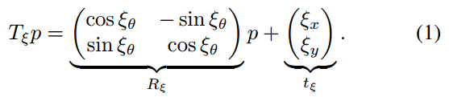

**B. Submaps**
A few consecutive scans are used to build a `submap`. These submaps take the form of probability grids $M: r\mathbb{Z}\times r\mathbb{Z}\rightarrow [p_{min}, p_{max}]$ which map from discrete grid points at a given resolution $r$, for example 5cm, to values. These values can be thought of as the probability that a grid point is obstructed. For each grid point, we define the corresponding `pixel` to consist of all points that are closest to that grid point.
连续扫描帧组成`子图`。子图采用概率网格的形式$M: r\mathbb{Z}\times r\mathbb{Z}\rightarrow [p_{min}, p_{max}]$，根据给定分辨率$r$（例如5cm）将离散网格点映射成数值。 这些值可认为是网格点被阻挡的概率。 对于每个网格点，我们将相应的`像素`定义为最接近该网格点的所有点。

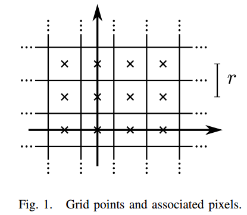

Whenever a scan is to be inserted into the probability grid, a set of grid points for `hits` and a disjoint set for `misses` are computed. For every hit, we insert the closest grid point into the hit set. For every miss, we insert the grid point associated with each pixel that intersects one of the rays between the scan origin and each scan point, excluding grid points which are already in the hit set. Every formerly unobserved grid point is assigned a probability $p_{hit}$ or $p_{miss}$ if it is in one of these sets. If the grid point $x$ has already been observed, we update the odds for hits and misses as
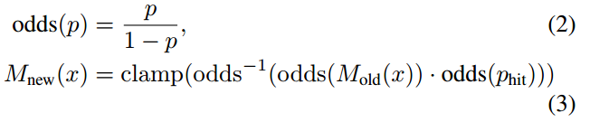
and equivalently for misses.
当有扫描要插入概率网格时，分别计算一组`击中`的网格点集和`不击中`的不相交集。 对于每个击中，我们将最近的网格点插入到击中集中。 对于每个不击中，我们插入与每个像素相关联的网格点，该网格点与扫描原点和每个扫描点之间的一条射线相交，不包括已经在击中集中出现的网格点。 如果每个以前未观察到的网格点位于其中一个集合时，则会为其分配概率$p_{hit}$或$p_{miss} $。 如果已经观察到网格点$x$，则更新其击中和不击中的概率

对于不击中的网格点进行同等操作。

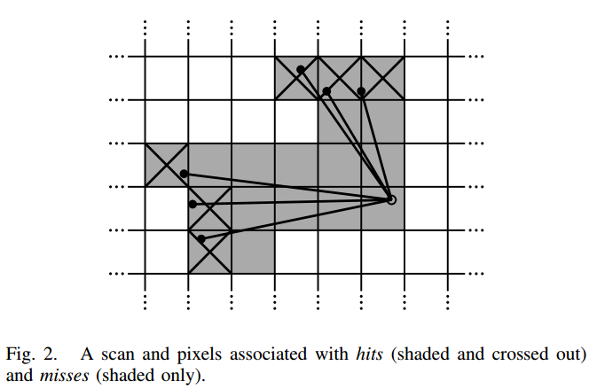

**C. Ceres scan matching**
Prior to inserting a scan into a submap, the scan pose $\xi$ is optimized relative to the current local submap using a Ceres-based [14] scan matcher. The scan matcher is responsible for finding a scan pose that maximizes the probabilities at the scan points in the submap. We cast this as a nonlinear least squares problem
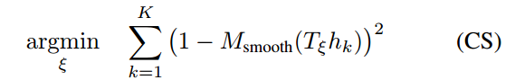
where $T_\xi$ transforms $h_k$ from the scan frame to the submap frame according to the scan pose. The function $M_{smooth}$: $\mathbb{R}^2 \rightarrow \mathbb{R}$ is a smooth version of the probability values in the local submap. We use bicubic interpolation. As a result, values outside the interval $[0,1]$ can occur but are considered harmless.
将扫描插入子图之前，使用Ceres[14]的扫描匹配器对扫描位姿$\xi$在相对局部子图位置进行优化。扫描匹配器负责从子图的扫描点中寻找最大化扫描点的概率的扫描位姿。我们把它当作一个非线性最小二乘问题

其中$T_\xi$为根据扫描位姿将$ h_k $从扫描帧转换为子图帧。 函数$M_{smooth}$：$\mathbb {R}^2 \rightarrow \mathbb{R}$为局部子图中概率值的平滑处理。 我们使用双三次插值。 此时，函数值可能会发生在区间$[0,1]$之外，但可认为没有影响。

Mathematical optimization of this smooth function usually gives better precision than the resolution of the grid. Since this is a local optimization, good initial estimates are required. An IMU capable of measuring angular velocities can be used to estimate the rotational component $\theta$ of the pose between scan matches. A higher frequency of scan matches or a pixel-accurate scan matching approach, although more computationally intensive, can be used in the absence of an IMU.
数学优化该平滑函数通常获得比网格分辨率更好的精度。 由于是局部优化，因此需要良好的初始估计值。 能够测量角速度的IMU可用于估计扫描匹配之间的位姿的旋转分量$\theta$。 尽管计算量更大，但可以在没有IMU的情况下使用更高频率的扫描匹配或像素级精准的扫描匹配方法。

## Closing Loops

As scans are only matched against a submap containing a few recent scans, the approach described above slowly accumulates error. For only a few dozen consecutive scans, the accumulated error is small.
由于扫描仅在包含少量近期扫描的子图上做匹配，因此上述方法会慢慢累积误差。 对于仅几十次连续扫描来说，累积误差其实很小。
罗23

Larger spaces are handled by creating many small submaps. Our approach, optimizing the poses of all scans and submaps, follows `Sparse Pose Adjustment` [2]. The relative poses where scans are inserted are stored in memory for use in the loop closing optimization. In addition to these relative poses, all other pairs consisting of a scan and a submap are considered for loop closing once the submap no longer changes. A scan matcher is run in the background and if a good match is found, the corresponding relative pose is added to the optimization problem.
处理大场景可通过构建很多小地图(子图)的方式进行处理。我们的方法采用Sparse Pose Adjustment[2](SPA)思想优化所有扫描和子图的位姿。扫描插入后的相对位姿存储于内存中以供回环检测直接使用。除了这些相对位姿之外，一旦子图不再发生变化，所有其他由扫描和子图构成的配对(注：即<扫描, 子图>)皆用于回环检测中。扫描匹配器在后台运行，如果找到良好匹配，则将相应的相对位姿添加到优化问题中。

**A. Optimization problem**

Loop closure optimization, like scan matching, is also formulated as a nonlinear least squares problem which allows easily adding residuals to take additional data into account. Once every few seconds, we use Ceres [14] to compute a solution to
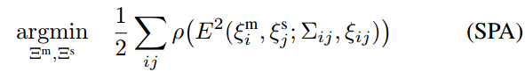
where the submap poses $\Xi^m=\{\xi_i^m\}_{i=1,\cdots,m}$ and the scan poses $\Xi^s=\{\xi_j^s\}_{j=1,\cdots,n}$ in the world are optimized given some constraints. These constraints take the form of relative poses $\xi_{ij}$ and associated covariance matrices $\Sigma_{ij}$. For a pair of submap $i$ and scan $j$, the pose $\xi_{ij}$ describes where in the submap coordinate frame the scan was matched. The covariance matrices $\Sigma_{ij}$ can be evaluated, for example, following the approach in [15], or locally using the covariance estimation feature of Ceres [14] with (CS). The residual $E$ for such a constraint is computed by
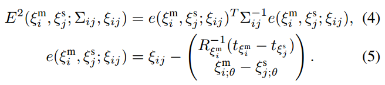
回环检测的优化，正如扫描的优化一样，可视作一个非线性最小二乘问题，它允许加入额外的数据以计算残差。每隔几秒我们就用Ceres[14]计算下列问题的解

其中世界坐标下子图位姿$\Xi^m=\{\xi_i^m\}_{i=1,\cdots,m}$和扫描位姿$\Xi^s=\{\xi_j^s\}_{j=1,\cdots,n}$在给定某些约束情况下可获得优化。这些约束采用相对位姿$\xi_{ij}$的形式，并与协方差矩阵$\Sigma_{ij}$关联。对第$i$个子图和第$j$个扫描配对，位姿$\xi_{ij}$描述了在子图坐标下扫描匹配的位置。协方差矩阵$\Sigma_{ij}$通过估算得到，例如，用文献[15]提出的方法，或局部使用Ceres和(CS)提供的协方差估算特性。在这样的约束下，残差$E$的计算为：

A loss function $\rho$, for example Huber loss, is used to reduce the influence of outliers which can appear in (SPA) when scan matching adds incorrect constraints to the optimization problem. For example, this may happen in locally symmetric environments, such as office cubicles. Alternative approaches to outliers include [16].
损失函数$\rho$，例如Huber loss，用于减少当扫描匹配为优化问题添加不正确约束时可能出现于（SPA）中的外点的影响。 例如，这种情况可能发生在局部对称的环境中，例如的办公室隔间。 处理外点的替代方法还包括文献[16]所提的方法。

**B. Branch-and-bound scan matching**
We are interested in the optimal, pixel-accurate match
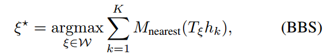
where $W$ is the search window and $M_{nearest}$ is $M$ extended to all of $\mathbb{R}^2$ by rounding its arguments to the nearest grid point first, that is extending the value of a grid points to the corresponding pixel. The quality of the match can be improved further using (CS).
我们的兴趣在于最佳的像素精确匹配

其中 $W$ 是搜索窗口大小，$M_{nearest}$为将$M$通过将其参数四舍五入到最近的网格点(即将网格点的值转换到相应的像素上)扩展到所有的二维平面$\mathbb{R}^2$。匹配质量可进一步通过(CS)改善。

Efficiency is improved by carefully choosing step sizes. We choose the angular step size $\delta_\theta$ so that scan points at the maximum range $d_{max}$ do not move more than $r$, the width of one pixel. Using the law of cosines, we derive
通过仔细选择步长来提高效率。 我们选择角度步长$\delta_\theta$，使得在最远处$d_{max}$的扫描没有移动超过一个像素的距离$r$。利用余弦定律可推导得到
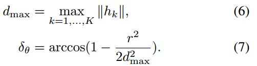

We compute an integral number of steps covering given linear and angular search window sizes, e.g., $W_x = W_y = 7m$ and $W_θ = 30^{\circ}$,
我们用所述步骤计算了给定线性和角度搜索窗口大小的整数数值， 即$W_x = W_y = 7m$和$W_θ = 30^{\circ}$,
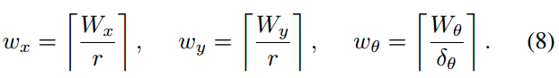

This leads to a finite set $\mathcal{W}$ forming a search window around an estimate $\xi_0$ placed in its center,
这将得到一个有限集合$\mathcal{W}$，形成一个以估计值 $\xi_0$为中心的搜索窗，
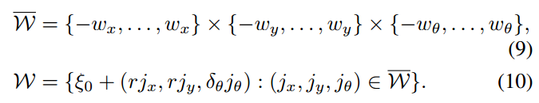
A naive algorithm to find $\xi^*$ can easily be formulated, see Algorithm 1, but for the search window sizes we have in mind it would be far too slow.
此时，很容易建立一个找到$\xi^*$的简单算法，请参见算法1，但对于搜索窗口大小，我们应当铭记它会特别慢。
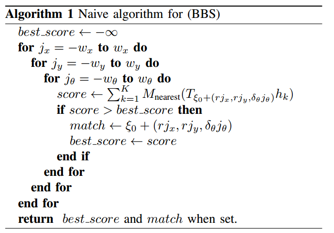

Instead, we use a branch and bound approach to efficiently compute $\xi^*$ over larger search windows. See Algorithm 2 for the generic approach. This approach was first suggested in the context of mixed integer linear programs [17]. Literature on the topic is extensive; see [18] for a short overview.
相反，我们采用分支定界方法在较大的搜索窗口上高效计算$\xi^*$。 请参见算法2加深这个通用方法。 这种方法首先在混合整数线性规划的背景下提出[17]。 关于这个主题的文献很广泛; [18]为它的一个简要概述。
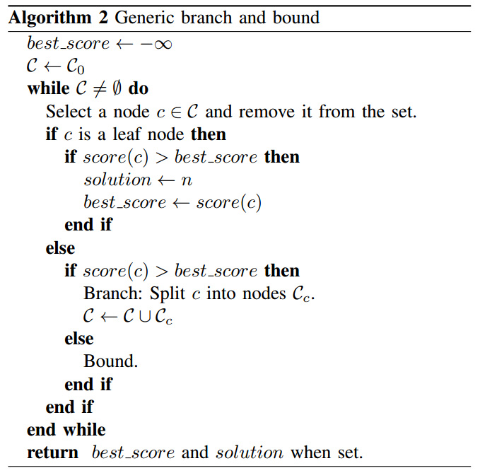

The main idea is to represent subsets of possibilities as nodes in a tree where the root node represents all possible solutions, $W$ in our case. The children of each node form a partition of their parent, so that they together represent the same set of possibilities. The leaf nodes are singletons; each represents a single feasible solution. Note that the algorithm is exact. It provides the same solution as the naive approach, as long as the $score(c)$ of inner nodes $c$ is an upper bound on the score of its elements. In that case, whenever a node is bounded, a solution better than the best known solution so far does not exist in this subtree.
分枝定界主要的思想是将所有的可能的子集表示为树中的节点，其中根节点表示所有可能的解，在我们的例子中为$W$。每个节点的子节点构成父节点的一个划分，以使它们能表示可能性中某个相同的集合。叶节点为单体结构；每个叶子节点代表一个可行解。注意算法是精确的。只要内部节点$c$的得分$score(c)$是其元素得分的上界，它就提供了与简单方法相同的解。此时，只要一个节点是有界的，该子树中就不存在比目前已知的解还要好的解。

To arrive at a concrete algorithm, we have to decide on the method of node selection, branching, and computation of upper bounds.
为得到具体算法，我们必须决定节点选择、分枝、和上界计算的方式。

**1) Node selection(节点选择)**: 
Our algorithm uses depth-first search (DFS) as the default choice in the absence of a better alternative: The efficiency of the algorithm depends on a large part of the tree being pruned. This depends on two things: a good upper bound, and a good current solution. The latter part is helped by DFS, which quickly evaluates many leaf nodes. Since we do not want to add poor matches as loop closing constraints, we also introduce a score threshold below which we are not interested in the optimal solution.  Since in practice the threshold will not often be surpassed, this reduces the importance of the node selection or finding an initial heuristic solution. Regarding the order in which the children are visited during the DFS, we compute the upper bound on the score for each child, visiting the most promising child node with the largest bound first. This method is Algorithm 3.
在没有更好选择情况下，我们的算法使用深度优先搜索（DFS）作为默认选择：算法的效率取决于被修剪的树的很大一部分。这实际上取决于两件事：一个好的上限和一个对当前问题的较好的解。后一部分由DFS辅助，它可以快速评估很多叶子节点。由于我们不想将较差的匹配作为回环检测的约束，因此我们还引入了一个分数阈值，我们对低于该阈值的最优解不感兴趣。由于在实践中我们的解通常不会超过阈值，因此它降低了节点选择或查找初始启发式解的重要性。对于在DFS期间访问子节点的顺序，我们计算每个子节点的得分上限，优先访问能最大边界、最有希望的子节点。该方法即为算法3。
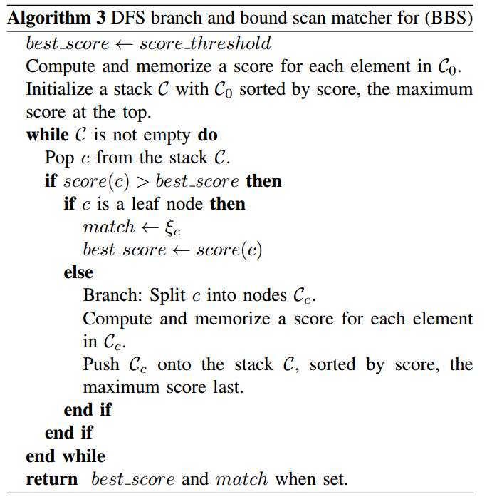

**2) Branching rule(分枝法则)**: 
Each node in the tree is described by a tuple of integers $c = (c_x, c_y, c_\theta, c_h) \in \mathbb{Z}^4$. Nodes at height $c_h$ combine up to $2^{c_h}\times 2^{c_h}$ possible translations but represent a specific rotation:
树中的每个节点由一个整数元组$c = (c_x, c_y, c_\theta, c_h) \in \mathbb{Z}^4$表示。在高度为$c_h$的节点最多组合$2^{c_h}\times 2^{c_h}$种可能变换，此外还表示特定的旋转：
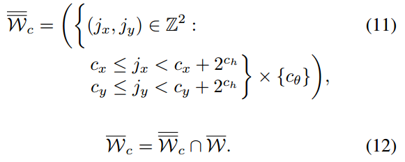
Leaf nodes have height $c_h = 0$, and correspond to feasible solutions $\mathcal{W}\ni \xi_c = \xi_0 + (rc_x, rc_y, \delta_\theta c_\theta)$.
叶子节点的高度为$c_h = 0$, 对应于一个可行的解$\mathcal{W}\ni \xi_c = \xi_0 + (rc_x, rc_y, \delta_\theta c_\theta)$。

In our formulation of Algorithm 3, the root node, encompassing all feasible solutions, does not explicitly appear and branches into a set of initial nodes $\mathcal{C}_0$ at a fixed height $h_0$ covering the search window
在算法3的公式中，包含所有可行解的根节点，在固定高度$h_0$并没有显式出现和分岔成初始点$\mathcal{C}_0$的一个集合并覆盖搜索窗口。

At a given node $c$ with $c_h > 1$, we branch into up to four children of height $c_h − 1$
对于一个给定的高度为$c_h > 1$的节点$c$，我们将它分岔为4个高度为$c_h − 1$的子节点
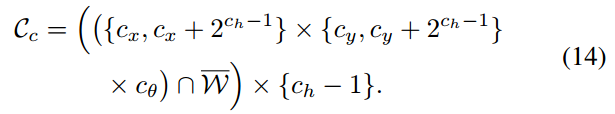

**3) Computing upper bounds(计算上界)**: 
The remaining part of the branch and bound approach is an efficient way to compute upper bounds at inner nodes, both in terms of computational effort and in the quality of the bound. We use 
分枝定界法的其余部分是计算内部节点上边界的一种有效方式，无论是计算效率还是计算出来的边界质量。使用下式进行计算
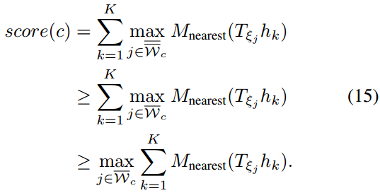

To be able to compute the maximum efficiently, we use precomputed grids $M_{precomp}^{c_h}$. Precomputing one grid per possible height $c_h$ allows us to compute the score with effort linear in the number of scan points. Note that, to be able to do this, we also compute the maximum over $\overline{\overline{W_c}}$ which can be larger than $\overline{W_c}$ near the boundary of our search space.
为有效计算最大值，我们预先在每个可能的高度$c_h$计算一个网格，它可以使我们以线段化方式计算扫描得分。注意，为做到这一点，我们还计算了超过$\overline{\overline{W_c}}$的极值，该值可以大于搜索空间边界附近的$\overline{W_c}$。
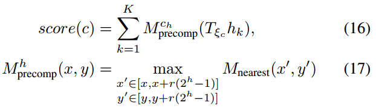

with $\xi_c$ as before for the leaf nodes. Note that $M_{precomp}^h$ has the same pixel structure as $M_{nearest}$, but in each pixel storing the maximum of the values of the $2^h \times 2^h$ box of pixels beginning there. An example of such precomputed grids is given in Figure 3.
其中$\xi_c$为叶子节点，与以前符号一致。注意，$M_{precomp}^h$与$M_{nearest}$具有相同的像素结构，但在每个像素中存储的是大小为$2^h \times 2^h$的框的像素的最大值。像这样预计算的网格的一个例子可见于图3.
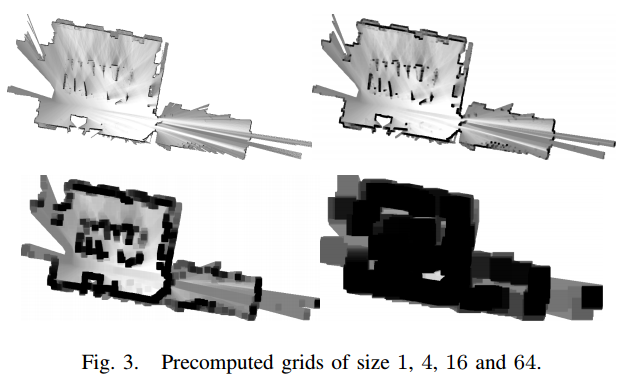

To keep the computational effort for constructing the precomputed grids low, we wait until a probability grid will receive no further updates. Then we compute a collection of precomputed grids, and start matching against it.
为了将预计算网格的计算量保持在较低的水平，我们等待概率网格直到不再收到更新。然后我们计算一组预计算的网格，并开始与之匹配。

For each precomputed grid, we compute the maximum of a $2^h$ pixel wide row starting at each pixel. Using this intermediate result, the next precomputed grid is then constructed.
对于每个预计算的网格，我们计算从每个像素开始、最长$2^h$个像素宽的行的最大值。利用这个中间结果构建下一个预计算网格。

The maximum of a changing collection of values can be kept up-to-date in amortized $\mathcal{O}(1)$ if values are removed in the order in which they have been added. Successive maxima are kept in a deque that can be defined recursively as containing the maximum of all values currently in the  collection followed by the list of successive maxima of all values after the first occurrence of the maximum. For an empty collection of values, this list is empty. Using this approach, the precomputed grids can be computed in $\mathcal{O}(n)$ where $n$ is the number of pixels in each precomputed grids.
如果按照值添加的次序删除值，则更改值最大可以以$\mathcal{O}(1)$的计算代价实现更新。将连续最大值保存在一个双端队列中，它可以递归地定义为包含当前集合中所有值的最大值，然后是第一次出现最大值后所有值的连续最大值的列表。对于空值集合，此列表为空。用这种方法，可以以$\mathcal{O}(n)$的复杂度计算预计算的网格，其中$n$为每个预计算网格中的像素数。

An alternative way to compute upper bounds is to compute lower resolution probability grids, successively halving the resolution, see [1]. Since the additional memory consumption of our approach is acceptable, we prefer it over using lower resolution probability grids which lead to worse bounds than (15) and thus negatively impact performance.
计算上限的另一种方法是计算较低分辨率的概率网格：连续减半分辨率，见[1]。 由于我们方法使用的额外内存在可接受范围内，我们偏向使用我们的方法而不是使用较低分辨率的概率网格的方式，因为它会产生比（15）更差的边界，从而对性能产生负面影响。

## EXPERIMENTAL RESULTS
In this section, we present some results of our SLAM algorithm computed from recorded sensor data using the same online algorithms that are used interactively on the backpack. First, we show results using data collected by the sensors of our Cartographer backpack in the Deutsches Museum in Munich. Second, we demonstrate that our algorithms work well with inexpensive hardware by using data collected from  a robotic vacuum cleaner sensor. Lastly, we show results using the Radish data set [19] and compare ourselves to published results.
本节中，我们将使用在背包上交互的在线算法，展示SLAM算法从传感器记录的数据中计算出的部分结果。
首先，我们展示从Cartographer背包传感器收集的慕尼黑德意志博物馆的回放数据的计算结果。 其次，我们通过从机器人真空吸尘器所携带的传感器收集的数据证明我们的算法适用于廉价硬件。 最后，我们从Radish数据集[19]计算结果，并与已发布的结果进行比较。

**A. Real-World Experiment: Deutsches Museum**
Using data collected at the Deutsches Museum spanning 1913s of sensor data or 2253m (according to the computed solution), we computed the map shown in Figure 4. On a workstation with an Intel Xeon E5-1650 at 3.2 GHz, our SLAM algorithm uses 1018s CPU time, using up to 2.2 GB of memory and up to 4 background threads for loop closure scan matching. It finishes after 360s wall clock time, meaning it achieved 5.3 times realtime performance.
使用在德意志博物馆收集的时间长度为1913秒、距离总长为2253米（根据计算的结果）的数据，我们计算出如图4所示的地图。在3.2 GHz的Intel Xeon E5-1650的工作站上，我们的SLAM算法使用1018秒的CPU时间，2.2 GB的内存和最多4个后台线程进行闭环检测扫描匹配。 算法在360秒后完成，意味着它实现了5.3倍的实时性能。

The generated graph for the loop closure optimization consists of 11456 nodes and 35300 edges. The optimization problem (SPA) is run every time a few nodes have been added to the graph. A typical solution takes about 3 iterations, and finishes in about 0.3s.
生成用于优化闭环检测的图由11456个节点和35300条边组成。 每当向图中加入几个节点时都会启动优化问题（SPA）。 该问题的解通常需要大约3次迭代，并在约0.3秒内完成。

** B. Real-World Experiment: Neato’s Revo LDS **
Neato Robotics uses a laser distance sensor (LDS) called Revo LDS [20] in their vacuum cleaners which costs under $30. We captured data by pushing around the vacuum cleaner on a trolley while taking scans at approximately 2Hz over its debug connection. Figure 5 shows the resulting 5cm resolution floor plan. To evaluate the quality of the floor plan, we compare laser tape measurements for 5 straight lines to the pixel distance in the resulting map as computed by a drawing tool. The results are presented in `Table I`, all values are in meters. The values are roughly in the expected order of magnitude of one pixel at each end of the line.
Neato Robotics公司在他们的真空吸尘器中使用一款称为Revo LDS [20]的激光测距传感器（LDS），售价低于30美元。我们推动手推车上的真空吸尘器以捕获数据，同时开启其调试连接以大约2Hz的速度采取扫描数据。 图5显示了5厘米分辨率的平面图。 为了评估构建平面地图的质量，我们将5条直线的激光带测量结果与绘图工具计算得到的地图中的像素距离进行比较。 结果如`表I`所示，所有值均以米为单位。 这些结果跟预期偏差一个像素的量级达成一致。

**C. Comparisons using the Radish data set**
We compare our approach to others using the benchmark measure suggested in [21], which compares the error in relative pose changes to manually curated ground truth relations. Table II shows the results computed by our Cartographer SLAM algorithm. For comparison, we quote results for Graph Mapping (GM) from [21]. Additionally, we quote more recently published results from [9] in Table III. All errors are given in meters and degrees, either absolute or squared, together with their standard deviation.
我们使用[21]中建议的基准测试将我们的方法与其他方法进行比较，将位姿变化的误差与手动构建的ground truth建立关系进行比较。 表II展显示了我们的Cartographer SLAM算法的结果。 为了比较，我们从[21]引用 Graph Mapping（GM）的结果。 此外，我们在表III中从[9]引用了最近公布的结果。 所有误差均以米和度给出，要么绝对值要么平方值，以及它们的标准差。

Each public data set was collected with a unique sensor configuration that differs from our Cartographer backpack. Therefore, various algorithmic parameters needed to be adapted to produce reasonable results. In our experience, tuning Cartographer is only required to match the algorithm to the sensor configuration and not to the specific surroundings.
每个公共数据集都采用特别配置的传感器配置方案进行采集，这些配置与我们的制图师Cartographer并不相同。 因此，需要调整算法的各种参数以产生合理的结果。 根据我们的经验，调整制图师(Cartographer)只需要将算法到与传感器的配置方案进行调整，而不需要针对特定环境调整。

Since each public data set has a unique sensor configuration, we cannot be sure that we did not also fit our parameters to the specific locations. The only exception being the Freiburg hospital data set where there are two separate relations files. We tuned our parameters using the local relations but also see good results on the global relations. The most significant differences between all data sets is the frequency and quality of the laser scans as well as the availability and quality of odometry.
由于每个公共数据集都有唯一的传感器配置方案，我们无法确定我们的配置方案是否与特定位置搭配。 唯一例外的是是弗莱堡医院数据集，它存在两个独立的关系文件。 我们根据该关系调整了参数的配置，但也看到即使使用统一配置亦结果良好。 所有数据集之间最明显的差异为激光扫描的频率、质量、以及里程(Odometry)的可用性及质量。

Despite the relatively outdated sensor hardware used in the public data sets, Cartographer SLAM consistently performs within our expectations, even in the case of MIT CSAIL, where we perform considerably worse than Graph Mapping. For the Intel data set, we outperform Graph Mapping, but not Graph FLIRT. For MIT Killian Court we outperform Graph Mapping in all metrics. In all other cases, Cartographer outperforms both Graph Mapping and Graph FLIRT in most but not all metrics.
尽管公共数据集中使用了相对过时的传感器硬件，但Cartographer SLAM的表现始终符合我们的预期，即使在MIT CSAIL的情况下，我们表现得比Graph Mapping差得多。 对于英特尔(Intel)数据集，我们的结果优于Graph Mapping，但不如Graph FLIRT。 对于麻省理工学院基利安法院(MIT Killian Court)的数据，我们在所有指标中都优于Graph Mapping。 在所有其他情况下，Cartographer在大多数指标中都优于Graph Mapping和Graph FLIRT，但并不是全部指标。

Since we add loop closure constraints between submaps and scans, the data sets contain no ground truth for them. It is also difficult to compare numbers with other approaches based on scan-to-scan. Table IV shows the number of loop closure constraints added for each test case (true and false positives), as well as the precision, that is the fraction of true positives. We determine the set of true positive constraints to be the subset of all loop closure constraints which are not violated by more than 20cm or $1^\circ$ when we compute (SPA). We see that while our scan-to-submap matching procedure produces false positives which have to be handled in the optimization (SPA), it manages to provide a sufficient number of loop closure constraints in all test cases. Our use of the Huber loss in (SPA) is one of the factors that renders loop closure robust to outliers. In the Freiburg hospital case, the choice of a low resolution and a low minimum score for the loop closure detection produces a comparatively high rate of false positives. The precision can be improved by raising the minimum score for loop closure detection, but this decreases the solution quality in some dimensions according to ground truth. The authors believe that the ground truth remains the better benchmark of final map quality.
由于我们在子图和扫描之间添加了闭环约束，因此数据集并不包含真实标记(ground truth)。与其他基于扫描到扫描的方法进行数据比较并不现实。表IV展示了为每个测试用例添加闭环约束的数量（真和假阳性），以及精度即真阳性的比率。我们认为真正的正约束集合是所有循环闭包约束的子集，当我们计算（SPA）时，这些约束不会带来超过20厘米或$1^\circ$的偏差。我们看到，虽然扫描到子图的匹配过程产生了必须在（SPA）中进行优化处理的误报，但它仍尽可能在所有测试用例中提供数量可观的回环约束。我们在（SPA）中使用Huber损失函数的方式是使回环检测对异常值具有鲁棒性的因素之一。在弗莱堡医院案例中，回环检测中选择低分辨率和最低得分会产生相对较高的误报率。通过提高闭环检测的最小分数可以提高精度，但是也会相对ground truth降低了某些维度的分辨率的质量。作者认为，ground truth仍为最终地图质量的基准。

The parameters of Cartographer’s SLAM were not tuned for CPU performance. We still provide the wall clock times in `Table V` which were again measured on a workstation with an Intel Xeon E5-1650 at 3.2 GHz. We provide the duration of the sensor data for comparison.
Cartographer的SLAM参数没有针对CPU性能进行调整。 我们仍然在`表V`中提供它的运算时间，这些时间是在一台3.2 GHz的Intel Xeon E5-1650的工作站上测量的。 我们还提供了数据采集传感器的持续时间以进行比较。

## CONCLUSIONS
In this paper, we presented and experimentally validated a 2D SLAM system that combines scan-to-submap matching with loop closure detection and graph optimization. Individual submap trajectories are created using our local, grid-based SLAM approach. In the background, all scans are matched to nearby submaps using pixel-accurate scan matching to create loop closure constraints. The constraint graph of submap and scan poses is periodically optimized in the background. The operator is presented with an upto-date preview of the final map as a GPU-accelerated combination of finished submaps and the current submap. We demonstrated that it is possible to run our algorithms on modest hardware in real-time.
在本文中，我们提出并实验验证了一个2D SLAM系统，该系统将扫描到子图的匹配与回环检测和图优化理论进行了结合。 我们使用基于局部网格的SLAM方法创建每个子图轨迹。 在后台，所有扫描都使用像素精确扫描方法匹配到邻近的子图，以创建闭合回环约束。 子图和扫描位姿所形成的约束图在后台进行定期优化。 对已完成的子图和当前子图进行GPU加速，可实现向操作员呈现最终地图的概览。我们证明了可以在小容量的计算硬件上实时运行我们的算法。

**ACKNOWLEDGMENTS**
This research has been validated through experiments in the Deutsches Museum, Munich. The authors thank its administration for supporting our work.
这项研究已在慕尼黑德意志博物馆进行实验验证。 我们对博物馆管理人员对我们工作的支持表示诚意的感谢。

Comparisons were done using manually verified relations and results from [21] which uses data from the Robotics Data Set Repository (Radish) [19]. Thanks go to Patrick Beeson, Dieter Fox, Dirk Hahnel, Mike Bosse, John Leonard, Cyrill Stachniss for providing this data. The data for the Freiburg University Hospital was provided by Bastian Steder, Rainer Kummerle, Christian Dornhege, Michael Ruhnke, Cyrill Stachniss, Giorgio Grisetti, and Alexander Kleiner.
通过人工验证数据帧的关系和[21]的结果进行了实验比较，[21]采用机器人数据集库Robotics Data Set Repository (Radish)（Radish）[19]的。 感谢Patrick Beeson，Dieter Fox，Dirk Hahnel，Mike Bosse，John Leonard和Cyrill Stachniss提供的实验数据。 弗莱堡大学医院的数据由Bastian Steder，Rainer Kummerle，Christian Dornhege，Michael Ruhnke，Cyrill Stachniss，Giorgio Grisetti和Alexander Kleiner提供。

## REFERECNE
[1] E. Olson, “M3RSM: Many-to-many multi-resolution scan matching,”in Proceedings of the IEEE International Conference on Robotics and Automation (ICRA), June 2015.
[2] K. Konolige, G. Grisetti, R. K¨ummerle, W. Burgard, B. Limketkai, and R. Vincent, “Sparse pose adjustment for 2D mapping,” in IROS, Taipei, Taiwan, 10/2010 2010.
[3] F. Lu and E. Milios, “Globally consistent range scan alignment for environment mapping,” Autonomous robots, vol. 4, no. 4, pp. 333–349, 1997.
[4] F. Mart´ın, R. Triebel, L. Moreno, and R. Siegwart, “Two different tools for three-dimensional mapping: DE-based scan matching and feature-based loop detection,” Robotica, vol. 32, no. 01, pp. 19–41, 2014.
[5] S. Kohlbrecher, J. Meyer, O. von Stryk, and U. Klingauf, “A flexible and scalable SLAM system with full 3D motion estimation,” in Proc. IEEE International Symposium on Safety, Security and Rescue Robotics (SSRR). IEEE, November 2011.
[6] M. Himstedt, J. Frost, S. Hellbach, H.-J. B¨ohme, and E. Maehle, “Large scale place recognition in 2D LIDAR scans using geometrical landmark relations,” in Intelligent Robots and Systems (IROS 2014), 2014 IEEE/RSJ International Conference on. IEEE, 2014, pp. 5030–5035.
[7] K. Granstr¨om, T. B. Sch¨on, J. I. Nieto, and F. T. Ramos, “Learning to close loops from range data,” The International Journal of Robotics Research, vol. 30, no. 14, pp. 1728–1754, 2011.
[8] G. Grisetti, C. Stachniss, and W. Burgard, “Improving grid-based SLAM with Rao-Blackwellized particle filters by adaptive proposals and selective resampling,” in Robotics and Automation, 2005. ICRA 2005. Proceedings of the 2005 IEEE International Conference on. IEEE, 2005, pp. 2432–2437.
[9] G. D. Tipaldi, M. Braun, and K. O. Arras, “FLIRT: Interest regions for 2D range data with applications to robot navigation,” in Experimental Robotics. Springer, 2014, pp. 695–710.
[10] J. Strom and E. Olson, “Occupancy grid rasterization in large environments for teams of robots,” in Intelligent Robots and Systems (IROS), 2011 IEEE/RSJ International Conference on. IEEE, 2011, pp. 4271–4276.
[11] R. K¨ummerle, G. Grisetti, H. Strasdat, K. Konolige, and W. Burgard, “g2o: A general framework for graph optimization,” in Robotics and Automation (ICRA), 2011 IEEE International Conference on. IEEE, 2011, pp. 3607–3613.
[12] L. Carlone, R. Aragues, J. A. Castellanos, and B. Bona, “A fast and accurate approximation for planar pose graph optimization,” The International Journal of Robotics Research, pp. 965–987, 2014.
[13] M. Bosse and R. Zlot, “Map matching and data association for largescale two-dimensional laser scan-based SLAM,” The International Journal of Robotics Research, vol. 27, no. 6, pp. 667–691, 2008.
[14] S. Agarwal, K. Mierle, and Others, “Ceres solver,” http://ceres-solver.org.
[15] E. B. Olson, “Real-time correlative scan matching,” in Robotics and Automation, 2009. ICRA’09. IEEE International Conference on. IEEE, 2009, pp. 4387–4393.
[16] P. Agarwal, G. D. Tipaldi, L. Spinello, C. Stachniss, and W. Burgard, “Robust map optimization using dynamic covariance scaling,” in Robotics and Automation (ICRA), 2013 IEEE International Conference on. IEEE, 2013, pp. 62–69.
[17] A. H. Land and A. G. Doig, “An automatic method of solving discrete programming problems,” Econometrica, vol. 28, no. 3, pp. 497–520, 1960.
[18] J. Clausen, “Branch and bound algorithms-principles and examples,”Department of Computer Science, University of Copenhagen, pp. 1–30, 1999.
[19] A. Howard and N. Roy, “The robotics data set repository (Radish),”2003. [Online]. Available: http://radish.sourceforge.net/
[20] K. Konolige, J. Augenbraun, N. Donaldson, C. Fiebig, and P. Shah, “A low-cost laser distance sensor,” in Robotics and Automation, 2008. ICRA 2008. IEEE International Conference on. IEEE, 2008, pp.3002–3008.
[21] R. K¨ummerle, B. Steder, C. Dornhege, M. Ruhnke, G. Grisetti, C. Stachniss, and A. Kleiner, “On measuring the accuracy of SLAM algorithms,” Autonomous Robots, vol. 27, no. 4, pp. 387–407, 2009.