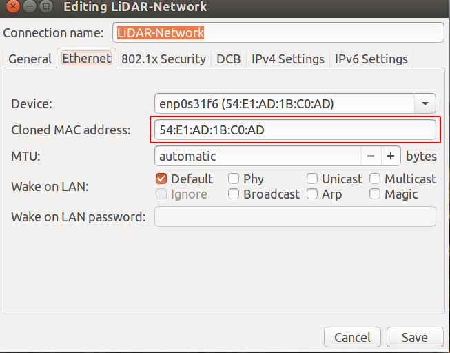
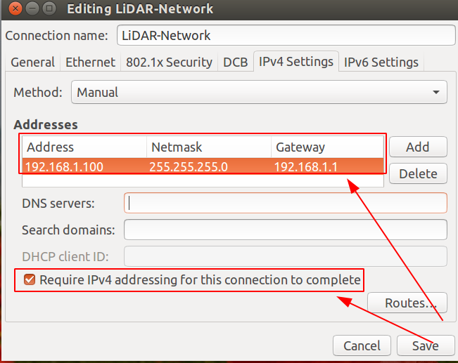
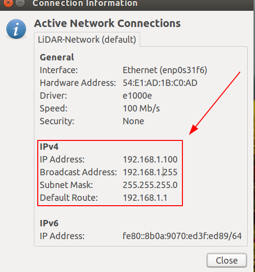
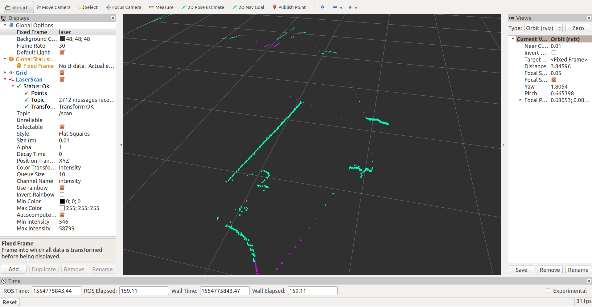

= ROS install guide for Osight LSXXX^TM^ LiDAR
Huiwu Luo <huiwu.luo@aliyun.com>
0.1, April, 2019, using Asciidoctor 1.5 article template
:toc:
:icons: font
:quick-uri: http://asciidoctor.org/docs/asciidoc-syntax-quick-reference/

A guide to install the Osight http://www.osighttech.com/pro_detail.php?id=10[LSXXX^TM^] LiDAR driver under ROS platform.

[[img-osight]]
image::./figs/Osight-LSXXX.png[align="center", caption="", title="LSXXX^TM^ LiDAR", alt="Sunset", width="200", height="220", link="http://www.osighttech.com/pro_detail.php?id=10"]

== Introduction

The Osight LSXXX^TM^ is a 2D LiDAR sensor produced by http://www.osighttech.com/[Ninbo *Osight* Photoelectric technology Co.,LTD].

ROS driver package can be download from link:./packages/catkin_osight.tar.gz[**here**].


== Installation Instructions
_(Note: we will make a few adjustments according to our experience.)_

==== Install ROS driver

* Download ROS driver package:
``` bash
$ cd ~
$ wget  https://github.com/teddyluo/LiDAR-SLAM-RES/raw/master/notes/packages/catkin_osight.tar.gz
$ tar xzvf ./catkin_osight.tar.gz
```

* Compile driver:

``` bash
$ cd ~/catkin_osight
$ catkin_make
```
 
* Configure working environment:


For bash user:
[source, bash]
----
$ source devel/setup.bash
$ echo "source ~/catkin_osight/devel/setup.bash" >> ~/.bashrc
----

For zsh user:
[source, bash]
----
$ source devel/setup.zsh
$ echo "source ~/catkin_osight/devel/setup.zsh" >> ~/.zshrc
----

==== Network Configuration
* Connect LiDAR with your computer, then configure your computer according to:

[source, bash]
----
IP: 192.168.1.100
Network mask: 255.255.255.0
Geteway: 192.168.1.1
----

[.float-group]
--
[.left]
.Network Configuration for MAC


[.right]
.Network Configuration for IP

--

_Note: Please ensure that the network has been correctly configured as shown in the following figure:_

.Network Configuration Information


** Test network connection:
[source, bash]
----
$ ping 192.168.1.10
PING 192.168.1.10 (192.168.1.10) 56(84) bytes of data.
64 bytes from 192.168.1.10: icmp_seq=1 ttl=255 time=0.286 ms
64 bytes from 192.168.1.10: icmp_seq=2 ttl=255 time=0.520 ms
64 bytes from 192.168.1.10: icmp_seq=3 ttl=255 time=0.357 ms
64 bytes from 192.168.1.10: icmp_seq=4 ttl=255 time=0.374 ms
----

==== Test ROS driver
[source, bash]
----
# terminal-1: launch roscore 
$ roscore
# terminal-2: launch LSxxx node
$ rosrun lsxxx LSxxx_node _hostPC:=192.168.1.100
#
# terminal-3: view results
$ rosrun rviz rviz
# additional operations:
#  1) add by topic -> LaserScan -> Topic: /scan
#  2) FixedFrame: laser
# Enjoy!
----

You should see a similr results in the riviz windos: 

.Network Configuration Information



#### __Error diagnosis__

. Network configuation problem:

[source, bash]
----
$ ping 192.168.1.10
PING 192.168.1.10 (192.168.1.10) 56(84) bytes of data.
From 192.168.1.100 icmp_seq=1 Destination Host Unreachable
From 192.168.1.100 icmp_seq=2 Destination Host Unreachable
From 192.168.1.100 icmp_seq=3 Destination Host Unreachable
----

**Solution**:
====
Tighten the screw  between the LiDAR sensor and the host computer.
====