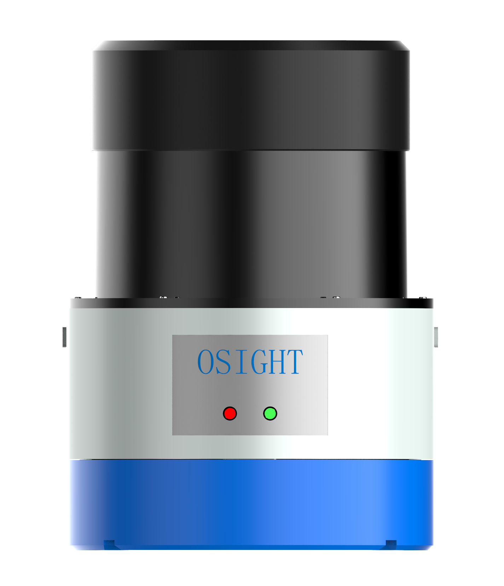

= ROS install guide for Osight LSXXX^TM^ LiDAR
Huiwu Luo <huiwu.luo@aliyun.com>
0.1, April, 2019, using Asciidoctor 1.5 article template
:toc:
:icons: font
:quick-uri: http://asciidoctor.org/docs/asciidoc-syntax-quick-reference/

A guide to install the Osight http://www.osighttech.com/pro_detail.php?id=10[LSXXX^TM^] LiDAR driver under ROS platform.

[[img-osight]]


== Introduction

The Osight LSXXX^TM^ is a 2D LiDAR sensor produced by http://www.osighttech.com/[Ninbo *Osight* Photoelectric technology Co.,LTD].

ROS driver package can be download from link:./packages/catkin_osight.tar.gz[**here**].


== Installation Instructions
_(Note: we will make a few adjustments according to our experience.)_

==== Install ROS driver

* Download ROS driver package:
``` bash
cd ~
wget  https://github.com/teddyluo/LiDAR-SLAM-RES/raw/master/notes/packages/catkin_osight.tar.gz
tar jxvf catkin_osight.tar.gz
```

* Compile driver:

``` bash
cd ~/catkin_osight
catkin_make
```
 
* Configure working environment:


For bash user:
[source, bash]
----
source devel/setup.bash
echo "source ~/catkin_osight/devel/setup.bash" >> ~/.bashrc
----

For zsh user:
[source, bash]
----
source devel/setup.zsh
echo "source ~/catkin_osight/devel/setup.zsh" >> ~/.zshrc
----

==== Network Configuration
* Connect LiDAR with your computer, then configure your computer according to:

[source, bash]
----
IP: 192.168.1.100
Network mask: 255.255.255.0
Geteway: 192.168.1.1
----

** Test network connection: `ping 192.168.1.10`


