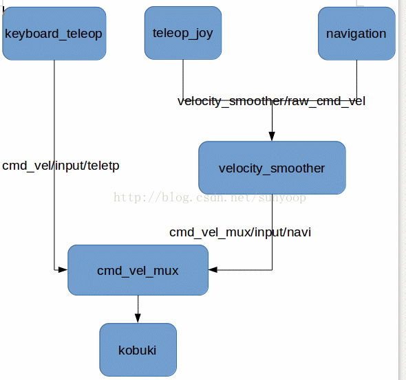
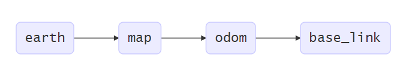

Turtlebot 2e 导航之`move_base` 参数详解
====

[toc]

ROS的`move_base`正如其名，是用于基座移动的功能包，用于实现基座的移动。为把握`move_base`对于`costmap2D`，`global planner`，`local planner`的调用关系。 
这里采用`turtlebot_navigation`的package 为例进行说明。

## `move_base`的启动代码

启动`move_base`的launch文件内容通常为（以Turtlebot 2e为例）：
- 在`turtlebot_apps/turtlebot_navigation/launch/amcl_demo.launch`的启动代码为：

```xml
  <!-- Move base -->
  <arg name="custom_param_file" default="$(find turtlebot_navigation)/param/$(arg 3d_sensor)_costmap_params.yaml"/>
  <include file="$(find turtlebot_navigation)/launch/includes/move_base.launch.xml">
    <arg name="custom_param_file" value="$(arg custom_param_file)"/>
  </include>
```

- 在`turtlebot_apps/turtlebot_navigation/launch/gmapping_demo.launch`中的启动代码为：

```xml
  <!-- Move base -->
  <include file="$(find turtlebot_navigation)/launch/includes/move_base.launch.xml"/>
```

可见建图的过程中采用的是默认参数，而导航过程考虑了3D sensor的传感器特征。以下看看各种传感器的`costmap_param.yaml`定义：
```bash
$ ls -al
total 48
lrwxrwxrwx 1 teddyluo teddyluo   10 5月  15 20:43 astra_costmap_params.yaml -> dummy.yaml
lrwxrwxrwx 1 teddyluo teddyluo   10 5月  15 20:43 asus_xtion_pro_costmap_params.yaml -> dummy.yaml
lrwxrwxrwx 1 teddyluo teddyluo   10 5月  15 20:43 asus_xtion_pro_offset_costmap_params.yaml -> dummy.yaml
-rw-rw-r-- 1 teddyluo teddyluo 1621 5月  15 20:43 costmap_common_params.yaml
-rw-rw-r-- 1 teddyluo teddyluo   57 5月  15 20:43 dummy.yaml
-rw-rw-r-- 1 teddyluo teddyluo 2262 5月  15 20:43 dwa_local_planner_params.yaml
-rw-rw-r-- 1 teddyluo teddyluo  405 5月  15 20:43 global_costmap_params.yaml
-rw-rw-r-- 1 teddyluo teddyluo 1730 5月  15 20:43 global_planner_params.yaml
lrwxrwxrwx 1 teddyluo teddyluo   10 5月  15 20:43 kinect_costmap_params.yaml -> dummy.yaml
-rw-rw-r-- 1 teddyluo teddyluo  394 5月  15 20:43 local_costmap_params.yaml
-rw-rw-r-- 1 teddyluo teddyluo  695 5月  15 20:43 lsxxx_costmap_params.yaml
-rw-rw-r-- 1 teddyluo teddyluo 1764 5月  15 20:43 move_base_params.yaml
```
其中 `dummy.yaml`是个空文件。

可以看到，最常用的传感器的`$(arg 3d_sensor)_costmap_params.yaml`并没有定义。可以认为这两条指令是等价的。

## `move_base.launch.xml`的内容
```xml
<!-- 
    ROS navigation stack with velocity smoother and safety (reactive) controller
-->
<launch>
  <include file="$(find turtlebot_navigation)/launch/includes/velocity_smoother.launch.xml"/>
  <include file="$(find turtlebot_navigation)/launch/includes/safety_controller.launch.xml"/>
  
  <arg name="odom_frame_id"   default="odom"/>
  <arg name="base_frame_id"   default="base_footprint"/>
  <arg name="global_frame_id" default="map"/>
  <arg name="odom_topic" default="odom" />
  <arg name="laser_topic" default="scan" />
  <arg name="custom_param_file" default="$(find turtlebot_navigation)/param/dummy.yaml"/>

  <node pkg="move_base" type="move_base" respawn="false" name="move_base" output="screen">
    <rosparam file="$(find turtlebot_navigation)/param/costmap_common_params.yaml" command="load" ns="global_costmap" />
    <rosparam file="$(find turtlebot_navigation)/param/costmap_common_params.yaml" command="load" ns="local_costmap" />   
    <rosparam file="$(find turtlebot_navigation)/param/local_costmap_params.yaml" command="load" />   
    <rosparam file="$(find turtlebot_navigation)/param/global_costmap_params.yaml" command="load" />
    <rosparam file="$(find turtlebot_navigation)/param/dwa_local_planner_params.yaml" command="load" />
    <rosparam file="$(find turtlebot_navigation)/param/move_base_params.yaml" command="load" />
    <rosparam file="$(find turtlebot_navigation)/param/global_planner_params.yaml" command="load" />
    <rosparam file="$(find turtlebot_navigation)/param/navfn_global_planner_params.yaml" command="load" />
    <!-- external params file that could be loaded into the move_base namespace -->
    <rosparam file="$(arg custom_param_file)" command="load" />
    
    <!-- reset frame_id parameters using user input data -->
    <param name="global_costmap/global_frame" value="$(arg global_frame_id)"/>
    <param name="global_costmap/robot_base_frame" value="$(arg base_frame_id)"/>
    <param name="local_costmap/global_frame" value="$(arg odom_frame_id)"/>
    <param name="local_costmap/robot_base_frame" value="$(arg base_frame_id)"/>
    <param name="DWAPlannerROS/global_frame_id" value="$(arg odom_frame_id)"/>

    <remap from="cmd_vel" to="navigation_velocity_smoother/raw_cmd_vel"/>
    <remap from="odom" to="$(arg odom_topic)"/>
    <remap from="scan" to="$(arg laser_topic)"/>
  </node>
</launch>
```

## 速度平滑功能包`velocity_smoother.launch.xml`
`velocity_smoother.launch.xml`为速度平滑包，是一个速度平滑控制器，用来防止robot navigation的速度/转速过快，加速度/快减速过大。smoother主要针对navigation或者其他一些例子。robot有一个命令选择node cmd_vel_mux，它可以防止robot被多个ros app下发的运动命令控制从而出现运动问题。见下图：



`velocity_smoother.launch.xml`的内容为：
```xml
<!-- 
         Velocity smoother
-->
<launch>
  <node pkg="nodelet" type="nodelet" name="navigation_velocity_smoother" args="load yocs_velocity_smoother/VelocitySmootherNodelet mobile_base_nodelet_manager">
    <rosparam file="$(find turtlebot_bringup)/param/defaults/smoother.yaml" command="load"/>
    <remap from="navigation_velocity_smoother/smooth_cmd_vel" to="cmd_vel_mux/input/navi"/>

    <!-- Robot velocity feedbacks; use the default base configuration -->
    <remap from="navigation_velocity_smoother/odometry" to="odom"/>
    <remap from="navigation_velocity_smoother/robot_cmd_vel" to="mobile_base/commands/velocity"/>
  </node>
</launch>
```
虽然在`move_base`脚本中启动，但smoother是一个`nodelete`，被`moibile_base_nodelete_manager`加载。其中`smoothrt.yaml`参数配置文件更是在`turtlebot_bringup` package下面。最后将节点中的发布的topic “`navigation_velocity_smoother/smooth_cmd_vel`” 重新映射成 “`cmd_vel_mux/input/navi`”，这样`cmd_vel_mux`就可以订阅到`smoother`发布的主题。

### 订阅的主题
```bash

~raw_cmd_vel (geometry_msgs/Twist)：输入的速度命令
~odometry (nav_msgs/Odometry):接收里程计信息，确保下发的运动命令没有大的跳跃。根据feedback参数配置
~robot_cmd_vel (geometry_msgs/Twist):接受robot 命令信息，确保下发的运动命令没有大的跳跃。根据feedback参数配置
```

### 发布的主题

```sh
~smooth_cmd_vel (geometry_msgs/Twist):发出来的命令，通常会将其remap到cmd_vel_mux订阅的运动命令topic上
```

### 参数
```bsh

~accel_lim_v (double):强制必须设置，线性加速度最大值
~accel_lim_w (double):强制必须设置，角加速度最大值
~speed_lim_v (double):强制必须设置，线速度最大值
~speed_lim_w (double):强制必须设置，角速度最大值
~decel_factor (double, default: 1.0):加减速比，对于惯性大的机器人
~frequency (double, default: 20.0):输出速度频率。不论输入命令的频率。必要时插值
~robot_feedback (int, default: 0):速度反馈(0 - none, 1 - odometry, 2 - end robot commands). 
```
### 参数配置文件`smoother.yaml`

```xml
# Default parameters used by the yocs_velocity_smoother module.
# This isn't used by minimal.launch per se, rather by everything
# which runs on top.
 
# Mandatory parameters
speed_lim_v: 0.8
speed_lim_w: 5.4
 
accel_lim_v: 1.0 # maximum is actually 2.0, but we push it down to be smooth
accel_lim_w: 2.0
 
# Optional parameters
frequency: 20.0
decel_factor: 1.5
 
# Robot velocity feedback type:
#  0 - none (default)
#  1 - odometry
#  2 - end robot commands
robot_feedback: 2
```

### 其他

1. 除了frequency其它参数都是动态可配置的

2. 如果有一个恒定的旋转半径，线/角速度会更加平滑

3. 输入的最后一个topic信息不为0时(命令下发node 崩溃/不活跃)，为了保证robot不出现意外，会在最后加一个0速度。

4. 使用yocs_cmd_vel_mux进行机器人速度控制切换，可参考以下博文：
https://www.cnblogs.com/21207-iHome/p/8228356.html

5. 关于velocity smooth算法，有篇比较好的综述文件：

Ravankar A, Ravankar A, Kobayashi Y, et al. Path smoothing techniques in robot navigation: State-of-the-art, current and future challenges[J]. Sensors, 2018, 18(9): 3170.

## 安全驾驶`safety_controller.launch.xml`

```xml
<!-- 
    Safety controller
-->
<launch>
  <node pkg="nodelet" type="nodelet" name="kobuki_safety_controller" args="load kobuki_safety_controller/SafetyControllerNodelet mobile_base_nodelet_manager">
    <remap from="kobuki_safety_controller/cmd_vel" to="cmd_vel_mux/input/safety_controller"/>
    <remap from="kobuki_safety_controller/events/bumper" to="mobile_base/events/bumper"/>
    <remap from="kobuki_safety_controller/events/cliff" to="mobile_base/events/cliff"/>
    <remap from="kobuki_safety_controller/events/wheel_drop" to="mobile_base/events/wheel_drop"/>
  </node>
</launch>
```
类似于`velocity_smoother`, `safety_controller`亦是一个notelet, 通过`mobile_base_nodelet_manager`加载。

ROS Wiki：http://wiki.ros.org/kobuki_safety_controller

`kobuki_safety_controller`可确保Kobuki的安全运行。 SafetyController可跟踪保险杠碰撞、悬崖和车轮跌落事件。 如果是前两个事件，则底卒Kobuki会被命令往回回。 若是后一种事件，Kobuki将停止。 `kobuki_safety_controller`控制器可以通过选项开启/禁用。 也可以重置安全状态（按下保险杠等）。 对操作的警告：很危险！ 所以一般情况下保持默认值即可。

`kobuki_safety_controller`控制器通常与Kobuki的最小应用配置(minimal.launch)或上层应用程序一起使用，例如：Kobuki随机行走、TurtleBot导航等。

## 坐标系的定义
ROS最常用的坐标系为`map`，`odom`，`base_link`，`base_laser`坐标系。这些坐标系无论是在AMCL或是Gmapping中都要用到的。

- `map`:地图坐标系，顾名思义，一般设该坐标系为固定坐标系（fixed frame），一般与机器人所在的世界坐标系一致。

- `base_link`:机器人本体坐标系，与机器人中心重合，坐标系原点一般为机器人的旋转中心。

- `base_footprint`坐标系原点为`base_link`原点在地面的投影，有些许区别（z值不同）。

- `odom`：里程计坐标系，这里要区分开odom topic，这是两个概念。一个是坐标系，一个是根据编码器（或者视觉等）计算的里程计。但是两者也有关系，odom topic 转化的位姿矩阵是odom-->base_link的tf关系。
   
   这时可有会有疑问，odom和map坐标系是不是重合的？可以很肯定的告诉你，机器人运动开始是重合的。但是，随着时间的推移是不重合的，而出现的偏差就是里程计的累积误差。那map-->odom的tf怎么得到?就是在一些校正传感器合作校正的package比如amcl会给出一个位置估计（localization），这可以得到map-->base_link的tf，所以估计位置和里程计位置的偏差也就是odom与map的坐标系偏差。所以，如果你的odom计算没有错误，那么map-->odom的tf就是0.

- `base_laser`:激光雷达的坐标系，与激光雷达的安装点有关，其与base_link的tf为固定的。

参考：http://www.ros.org/reps/rep-0105.html

### 如何理解`map`、`odom`、`base_link`三者关系
- 世界坐标(map)

该map坐标系是一个世界固定坐标系，其Z轴指向上方。相对于map坐标系的移动平台的姿态，不应该随时间显著移动。map坐标是不连续的，这意味着在map坐标系中移动平台的姿态可以随时发生离散的跳变。

典型的设置中，定位模块基于传感器的监测，不断的重新计算世界坐标中机器人的位姿，从而消除偏差，但是当新的传感器信息到达时可能会跳变。

map坐标系作为长期的全局参考是很有用的，但是跳变使得对于本地传感和执行器来说，其实是一个不好的参考坐标。

- 里程计坐标系(odom)

odom 坐标系是一个世界固定坐标系。在odom 坐标系中移动平台的位姿可以任意移动，没有任何界限。这种移动使得odom 坐标系不能作为长期的全局参考。然而，在odom 坐标系中的机器人的姿态能够保证是连续的，这意味着在odom 坐标系中的移动平台的姿态总是平滑变化，没有跳变。

在一个典型设置中，odom 坐标系是基于测距源来计算的，如车轮里程计，视觉里程计或惯性测量单元。

odom 坐标系作为一种精确，作为短期的本地参考是很有用的，但偏移使得它不能作为长期参考

- 基座标(base_link)

该base_link坐标刚性地连接到移动机器人基座。base_link可以安装在基座中的任意方位；对于每个硬件平台，在基座上的不同地方都会提供一个明显的参考点。

坐标之间的关系： 在机器人系统中，我们使用一棵树来来关联所有坐标系，因此每个坐标系都有一个父坐标系和任意子坐标系，如下：

map --> odom --> base_link
世界坐标系是odom坐标系的父，odom坐标系是base_link的父。虽然直观来说，map和odom应连接到base_link，这是不允许的，因为每坐标系只能有一个父类。

坐标系权限
odom到base_link的转换是由里程计源计算和发布的。然而，定位模块不发布map到base_link的转换(transform)。相反，定位模块先接收odom到base_link的 transform，并使用这个信息发布map到odom的transform。

通俗理解
odom和map坐标系在机器人运动开始是重合的。但是，随着时间的推移是不重合的，而出现的偏差就是里程计的累积误差。那map-->odom的tf就是在一些校正传感器合作校正的package比如gmapping会给出一个位置估计（localization），这可以得到map-->base_link的tf，所以估计位置和里程计位置的偏差也就是odom与map的坐标系偏差。所以，如果你的odom计算没有错误，那么map–->odom的tf就是



>The map frame is the parent of odom, and odom is the parent of base_link. Although intuition would say that both map and odom should be attached to base_link, this is not allowed because each frame can only have one parent.**

## `move_base`节点定义
 
 ```xml
 <node pkg="move_base" type="move_base" respawn="false" name="move_base" output="screen">
    <rosparam file="$(find turtlebot_navigation)/param/costmap_common_params.yaml" command="load" ns="global_costmap" /> #通用的costmap参数定义(全局空间)
    <rosparam file="$(find turtlebot_navigation)/param/costmap_common_params.yaml" command="load" ns="local_costmap" /> #通用的costmap参数定义(局部空间)
    <rosparam file="$(find turtlebot_navigation)/param/local_costmap_params.yaml" command="load" /> #本地的costmap参数定义 
    <rosparam file="$(find turtlebot_navigation)/param/global_costmap_params.yaml" command="load" /> #全局costmap参数定义
    <rosparam file="$(find turtlebot_navigation)/param/dwa_local_planner_params.yaml" command="load" /> #dwa本地规划参数定义
    <rosparam file="$(find turtlebot_navigation)/param/move_base_params.yaml" command="load" /> #底盘移动启动文件
    <rosparam file="$(find turtlebot_navigation)/param/global_planner_params.yaml" command="load" /> #全局规划参数定义
    <rosparam file="$(find turtlebot_navigation)/param/navfn_global_planner_params.yaml" command="load" /> #navfn全局规划参数定义
    <!-- external params file that could be loaded into the move_base namespace -->
    <rosparam file="$(arg custom_param_file)" command="load" />
    
    <!-- reset frame_id parameters using user input data -->
    <param name="global_costmap/global_frame" value="$(arg global_frame_id)"/>
    <param name="global_costmap/robot_base_frame" value="$(arg base_frame_id)"/>
    <param name="local_costmap/global_frame" value="$(arg odom_frame_id)"/>
    <param name="local_costmap/robot_base_frame" value="$(arg base_frame_id)"/>
    <param name="DWAPlannerROS/global_frame_id" value="$(arg odom_frame_id)"/>

    <remap from="cmd_vel" to="navigation_velocity_smoother/raw_cmd_vel"/>
    <remap from="odom" to="$(arg odom_topic)"/>
    <remap from="scan" to="$(arg laser_topic)"/>
  </node>
```
**注：`#`后表示注释。**

首先，代价地图的定义，包含全局代价地图和局部代价地图：
```xml
/param/costmap_common_params.yaml" command="load" ns="global_costmap"   
/param/costmap_common_params.yaml" command="load" ns="local_costmap" 
/param/local_costmap_params.yaml" command="load" 
/param/global_costmap_params.yaml" command="load"  #全局costmap参数定义
```
其次，加载了规划器的参数，
- DWA局部规划器的参数`dwa_local_planner_params.yaml`
- 全局规划器`global_planner`的参数`global_planner_params.yaml` `navfn_global_planner_params.yaml`
- 自定义参数`$(arg custom_param_file)`，由前面可知是一个空文件

最后，定义了坐标系：
- `global_costmap/global_frame` --> `map` 全局代价地图中全局坐标系为map
- `global_costmap/robot_base_frame` --> `base_footprint` 全局代价地图中机器人本体坐标系为`base_footprint`
- `local_costmap/global_frame` --> `odom` 局部代价的全局坐标系为odom
- `local_costmap/robot_base_frame` --> `base_footprint`  局部代价机器人本体坐标系为`base_footprint`
- `DWAPlannerROS/global_frame_id` --> `odom` DWA局部规划器中全局坐标系为`odom`

三个topic的remap:
- `cmd_vel` --> `navigation_velocity_smoother/raw_cmd_vel` 将速度话题`cmd_vel`remap为`navigation_velocity_smoother/raw_cmd_vel`
- `odom` --> `odom` `odom` remap为 `odom` (写得能通用，因为可以在前面改变topic的name)
- `scan` --> `scan` `scan` remap为 `scan`

**注：变量名称**
```xml
  <arg name="odom_frame_id"   default="odom"/>
  <arg name="base_frame_id"   default="base_footprint"/>
  <arg name="global_frame_id" default="map"/>
  <arg name="odom_topic" default="odom" />
  <arg name="laser_topic" default="scan" />
  <arg name="custom_param_file" default="$(find turtlebot_navigation)/param/dummy.yaml"/>
```
 理解为
 - 参数名`odom_frame_id`的默认值为`odom` (`odom`坐标系)
 - 参数名`base_frame_id`的默认值为`base_footprint` (`base_footprint`坐标系)
 - 参数名`global_frame_id`的默认值为`map` (`map`坐标系)
 - 参数名`odom_topic`的默认值为`odom` (`odom` topic)
 - 参数名`laser_topic`的默认值为`scan` (`scan` topic)
 - 参数名`custom_param_file`的默认值为`$(find turtlebot_navigation)/param/dummy.yaml`


### `turtlebot_ws/src/turtlebot_apps/turtlebot_navigation`目录的文件树结构

``` bash
├── CHANGELOG.rst
├── CMakeLists.txt
├── env-hooks                                                          #钩子
│   └── 25.turtlebot-navigation.sh.em                                  #设置一些稳定的默认值，目前是导出TURTLEBOT_MAP_FILE，使用默认的地图。
├── laser                                                              #雷达相关设置
│   ├── costmap_common_params.yaml                                     #costmap的通用参数
│   ├── laser_amcl_demo.launch                                         #激光amcl启动文件
│   ├── laser_gmapping_demo.launch                                     #激光gmapping启动文件
│   └── move_base_laser.launch                                         #带激光底盘移动启动文件
├── launch                                                             #启动目录
│   ├── amcl_demo.launch                                               #amcl启动文件     
│   ├── gmapping_demo.launch                                           #gmapping启动文件
│   ├── graveyard
│   │   └── graveyard_bump_navi_demo.launch                            #
│   └── includes                                                       #启动文件的子模块
│       ├── amcl                                                       #即时定位
│       │   ├── amcl.launch.xml                                        #即时定位核心启动文件
│       │   ├── astra_amcl.launch.xml -> amcl.launch.xml               #使用astra进行定位
│       │   ├── asus_xtion_pro_amcl.launch.xml -> amcl.launch.xml      #使用asus_xtion_pro进行定位
│       │   ├── asus_xtion_pro_offset_amcl.launch.xml -> amcl.launch.xml #使用asus_xtion_pro_live进行定位
│       │   ├── kinect_amcl.launch.xml -> amcl.launch.xml                #使用kinect进行定位
│       │   └── r200_amcl.launch.xml                                     #使用r200进行定位
│       ├── gmapping                                                             #实时建图
│       │   ├── astra_gmapping.launch.xml -> gmapping.launch.xml                 #使用astra建图 
│       │   ├── asus_xtion_pro_gmapping.launch.xml -> gmapping.launch.xml        #使用asus_xtion_pro建图
│       │   ├── asus_xtion_pro_offset_gmapping.launch.xml -> gmapping.launch.xml #使用asus_xtion_pro_live建图
│       │   ├── gmapping.launch.xml                                              #实际建图核心启动文件
│       │   ├── kinect_gmapping.launch.xml -> gmapping.launch.xml                #使用kinect建图 
│       │   └── r200_gmapping.launch.xml                                         #使用r200建图
│       ├── move_base.launch.xml                                                 #底盘移动启动文件
│       ├── safety_controller.launch.xml                                         #安全控制启动文件
│       └── velocity_smoother.launch.xml                                         #速度平滑启动文件
├── maps                                                                         #地图目录
│   ├── willow-2010-02-18-0.10.pgm
│   └── willow-2010-02-18-0.10.yaml
├── package.xml
├── param                                                                        #参数目录
│   ├── astra_costmap_params.yaml -> dummy.yaml                                  #astra的costmap参数定义,指向空文件
│   ├── asus_xtion_pro_costmap_params.yaml -> dummy.yaml                         #asus_xtion_pro的costmap参数定义,指向空文件
│   ├── asus_xtion_pro_offset_costmap_params.yaml -> dummy.yaml                  #asus_xtion_pro_live的costmap参数定义,指向空文件
│   ├── costmap_common_params.yaml                                               #通用的costmap参数定义
│   ├── dummy.yaml                                                               #空文件,没有自定义的参数设置
│   ├── dwa_local_planner_params.yaml                                            #dwa本地规划参数定义
│   ├── global_costmap_params.yaml                                               #全局costmap参数定义
│   ├── global_planner_params.yaml                                               #全局规划参数定义
│   ├── kinect_costmap_params.yaml -> dummy.yaml                                 #kinect的costmap参数定义,指向空文件
│   ├── local_costmap_params.yaml                                                #本地的costmap参数定义
│   ├── move_base_params.yaml                                                    #底盘移动参数定义
│   ├── navfn_global_planner_params.yaml                                         #navfn全局规划参数定义
│   └── r200_costmap_params.yaml                                                 #r200的costmap参数定义
└── src                                                                          #源码目录
    └── laser_footprint_filter.cpp                                               #激光过滤footprint源码, 订阅/scan话题,过滤后,重发布/scan_filtered话题
```

下面我们先看看环境代价地图的定义，再理解规划器的设置，最后看看move_base启动本身。

## 通用代价设置`costmap_common_params.yaml`
`costmap_common_params.yaml`整个文件定义为
```yaml
max_obstacle_height: 0.60  # assume something like an arm is mounted on top of the robot

# Obstacle Cost Shaping (http://wiki.ros.org/costmap_2d/hydro/inflation)
robot_radius: 0.20  # distance a circular robot should be clear of the obstacle (kobuki: 0.18)
# footprint: [[x0, y0], [x1, y1], ... [xn, yn]]  # if the robot is not circular

map_type: voxel

obstacle_layer:
  enabled:              true
  max_obstacle_height:  0.6
  origin_z:             0.0
  z_resolution:         0.2
  z_voxels:             2
  unknown_threshold:    15
  mark_threshold:       0
  combination_method:   1
  track_unknown_space:  true    #true needed for disabling global path planning through unknown space
  obstacle_range: 2.5
  raytrace_range: 3.0
  origin_z: 0.0
  z_resolution: 0.2
  z_voxels: 2
  publish_voxel_map: false
  observation_sources:  scan bump
  scan:
    data_type: LaserScan
    topic: scan
    marking: true
    clearing: true
    min_obstacle_height: 0.25
    max_obstacle_height: 0.35
  bump:
    data_type: PointCloud2
    topic: mobile_base/sensors/bumper_pointcloud
    marking: true
    clearing: false
    min_obstacle_height: 0.0
    max_obstacle_height: 0.15
  # for debugging only, let's you see the entire voxel grid

#cost_scaling_factor and inflation_radius were now moved to the inflation_layer ns
inflation_layer:
  enabled:              true
  cost_scaling_factor:  5.0  # exponential rate at which the obstacle cost drops off (default: 10)
  inflation_radius:     0.5  # max. distance from an obstacle at which costs are incurred for planning paths.

static_layer:
  enabled:              true
```
解析(http://wiki.ros.org/costmap_2d/hydro/obstacles)：
- `max_obstacle_height: 0.60` #传感器读数的最大有效高度，单位为 meters; 通常设置为略高于机器人的实际高度，高度是指包含机械臂打直情况下的最大高度。
- `robot_radius: 0.20` 机器人半径(圆形), kobuki是0.18m
- `footprint: [[x0, y0], [x1, y1], ... [xn, yn]]` 当机器人非圆形时，先找机器人的旋转中心，即两个轮的中心点设置成(0,0)，然后确定机器人摆放方向，x,y为每个robot几何型的每条边的每个顶点。将所有顶点都列到其中。就完成了robot的footprint。
- `map_type: voxel` 地图类型，这里为`voxel`(体素地图)。另一种地图类型为`costmap`(代价地图)。这两者之间的区别是前者是世界的3D表示，后者为世界的2D表示。
- `obstacle_layer` 障碍物层参数
  - `enabled`:              `true` #启用
  - `max_obstacle_height:  0.6` 传感器读数的最大有效高度（单位：m）。 通常设置为略高于机器人的高度。 此参数设置为大于全局max_obstacle_height参数的值将会失效。 设置为小于全局max_obstacle_height的值将过滤掉传感器上大于该高度以的点。
  - `origin_z:             0.0` z原点，单位为米，仅对voxel地图
  - `z_resolution:         0.2` z分辨率，单位meters/cell
  - `z_voxels:             2` 每个垂直列中的体素数目，ROS Nav功能包的默认值为10。请参考《ROS导航功能调优指南》https://github.com/teddyluo/ROSNavGuide-Chinese
  - `unknown_threshold:    15` 当整列的voxel是“已知”(``known'')的时候，含有的未知单元(“unknown”)的最大数量
  - `mark_threshold:       0` 整列voxel是“自由”("free")的时候，含有的已标记的cell(“marked”)的最大数目。
  - `combination_method:   1` 处理obstacle_laye之外的其他层传入数据的行为方式，枚举型(enum)。可能的取值有：覆盖已有值"Overwrite" (0), 取最大值"Maximum" (1), 什么也不干"Nothing" (99)。“覆盖”仅是“覆盖”其他层的数据，例如使得它们没有生效。 “取最大值”是多数时候需要的。 它提取obstacle_layer或输入数据中提供的数据的最大值。 “Nothing”根本不会改变传入的数据。 请注意，这会极大地影响costmap的行为方式，具体取决于您对track_unkown_space的设置。
  - `track_unknown_space:  true` 如果为false，每个像素具有两种状态之一：致命障碍(lethal)或自由(free)。 如果为true，则每个像素具有3种状态之一：致命障碍(lethal)，自由(free)或未知(unknown)。
  - `obstacle_range: 2.5`  将障碍物插入代价地图的最大范围，单位为 meters。
  - `raytrace_range: 3.0` 从地图中扫描出障碍物的最大范围，单位为 meters 。
  - `origin_z: 0.0` z原点，单位为米，仅对voxel地图（为什么定义2次？）
  - `z_resolution: 0.2` （为什么定义2次？）
  - `z_voxels: 2` （为什么定义2次？）
  - `publish_voxel_map: false` 是否发布底层的体素栅格地图，其主要用于可视化。
  - `observation_sources:  scan bump` # 观察源，我们这里是激光数据(scan)和凸点数据(bump)。观察源列表以空格分割表示，定义了下面参数中每一个 <source_name> 命名空间。
  - `scan`: 观察源之一：激光数据。定义了：观察源的数据类型，发布话题，标记和添加障碍物
    - `data_type: LaserScan` 观察源的数据类型：激光扫描
    - `topic: scan` 发布话题为`scan`
    - `marking: true` 启用标记障碍物功能
    - `clearing: true` 启用清除障碍物功能
    注：关于Marking and Clearing：
       - marking和clearing参数用来表示是否需要使用传感器的实时信息来添加或清除代价地图中的障碍物信息）
       - 代价地图自动订阅传感器主题并自动更新。
       - 每个传感器用于标记操作（将障碍物信息插入到代价地图中），清除操作（从代价地图中删除障碍物信息）或两者操作都执行。
       - 如果使用的是体素层，每一列上的障碍信息需要先进行投影转化成二维之后才能放入代价地图中。
    - `min_obstacle_height: 0.25` 传感器最低有效读数，以米为单位。通常设置为地面高度，但可以根据传感器的噪声模型设置为更高或更低。
    - `max_obstacle_height: 0.35` 传感器读数的最大有效高度，以米为单位。通常设置为略大于机器人的最大高度。设置为大于全局的max_obstacle_height的值会失效。设置为小于全局max_obstacle_height将从传感器上过滤掉该高度以上的点。
  - `bump`:观察源之二：凸点数据。定义了：观察源的数据类型，发布话题，标记和添加障碍物功能及定义传感器源数值的有效范围
    - `data_type: PointCloud2`   数据类型为点云
    - `topic: mobile_base/sensors/bumper_pointcloud` Topic为mobile_base/sensors/bumper_pointcloud
    - `marking: true` 启用标记障碍物功能
    - `clearing: false` 关闭清除障碍物功能
    - `min_obstacle_height: 0.0` 传感器最低有效读数，以米为单位。
    - `max_obstacle_height: 0.15` 传感器读数的最大有效高度，以米为单位。
- `inflation_layer`: 膨胀层参数
  - `enabled`:              true 启用膨胀地图
  - `cost_scaling_factor:  5.0`  # exponential rate at which the obstacle cost drops off (default: 10)
在膨胀期间应用于代价值的尺度因子。默认值：10。对在内接半径之外的cells、以及在内接半径之内的cells这两种不同的cells, 代价函数的计算公式为：
 `exp(-1.0 * cost_scaling_factor * (distance_from_obstacle - inscribed_radius)) * (costmap_2d::INSCRIBED_INFLATED_OBSTACLE - 1)`
 
其中`costmap_2d::INSCRIBED_INFLATED_OBSTACLE`当前取值为254.注意：由于`cost_scaling_factor`在公式中乘以负数，因此增加该因子的值会减少它的cost。

对该效果讨论请参考《ROS导航功能调优指南》。

  - inflation_radius:     0.5  # max. distance from an obstacle at which costs are incurred for planning paths.
 代价地图膨胀半径，以米为单位。默认值：0.55
- static_layer: 静态地图层
  - enabled:              true 启用静态地图

## 全局代价地图的设置
全局代价地图的设置主要有两个文件：
```xml
<rosparam file="$(find turtlebot_navigation)/param/costmap_common_params.yaml" command="load" ns="global_costmap" />
<rosparam file="$(find turtlebot_navigation)/param/global_costmap_params.yaml" command="load" />
```
其中，
- `costmap_common.yaml`为costmap的通用参数设置
- `global_costmap_params.yaml`为全局costmap的设置。
`costmap_common.yaml`在前面已有介绍。这里介绍`global_costmap_params.yaml'。它的定义为：

```xml
global_costmap:
   global_frame: /map
   robot_base_frame: /base_footprint
   update_frequency: 1.0
   publish_frequency: 0.5
   static_map: true
   transform_tolerance: 0.5
   plugins:
     - {name: static_layer,            type: "costmap_2d::StaticLayer"}
     - {name: obstacle_layer,          type: "costmap_2d::VoxelLayer"}
     - {name: inflation_layer,         type: "costmap_2d::InflationLayer"}
```
解析：
- `global_frame: /map` 全局代价地图需要在map参考坐标系下运行
- `robot_base_frame: /base_footprint` 全局代价地图使用机器人本体参考坐标系
- `update_frequency: 1.0` 全局地图信息更新的频率，单位是Hz
- `publish_frequency: 0.5` 发布频率，用于显示(例如rviz等)
- `static_map: true` 代价地图是否需要map_server提供的地图信息进行初始化。如果不需要使用已有的地图或者map_server，最好将该参数设置为false
- `transform_tolerance: 0.5` tf变换最大延时
global map引入了以下三层，经融合构成了master map，用于global planner
- plugins: 插件定义
     - `{name: static_layer,            type: "costmap_2d::StaticLayer"}` 静态地图层
     - `{name: obstacle_layer,          type: "costmap_2d::VoxelLayer"}`  障碍地图层
     - `{name: inflation_layer,         type: "costmap_2d::InflationLayer"}` 膨胀地图层，用于留出足够的安全距离

**这里有个疑问**：为什么`obstacle_layer`的类型不是普通的`costmap_2d::ObstacleLayer`？Turtlebot为什么将它设置为`costmap_2d::VoxelLayer`?其实在`costmap_common_params.yaml`也提到了，开启`bump`输入源是为了更好地可视化整个voxel层的情况，方便调试。所以这里将`obstacle_layer`的地图类型设置为`costmap_2d::VoxelLayer`。

## 局部代价地图的设置`local_costmap_params.yaml`
局部代价地图的设置主要有两个文件：
```xml
<rosparam file="$(find turtlebot_navigation)/param/costmap_common_params.yaml" command="load" ns="local_costmap" />
<rosparam file="$(find turtlebot_navigation)/param/local_costmap_params.yaml" command="load" />
```
其中，
- `costmap_common.yaml`为costmap的通用参数设置，`costmap_common.yaml`在前面已有介绍。
- `local_costmap_params.yaml'局部costmap的设置。

这里介绍`local_costmap_params.yaml'。它的定义为：

```xml
local_costmap:
   global_frame: odom
   robot_base_frame: /base_footprint
   update_frequency: 5.0
   publish_frequency: 2.0
   static_map: false
   rolling_window: true
   width: 4.0
   height: 4.0
   resolution: 0.05
   transform_tolerance: 0.5
   plugins:
    - {name: obstacle_layer,      type: "costmap_2d::VoxelLayer"}
    - {name: inflation_layer,     type: "costmap_2d::InflationLayer"}
```
解析
- `global_frame: odom` 局部代价地图使用`odom`坐标系
- `robot_base_frame: /base_footprint` 机器人本体参考坐标系为`/base_footprint`
- `update_frequency: 5.0` 局部地图更新频率
- `publish_frequency: 2.0` 发布显示频率
- `static_map: false` 不使用静态地图
- `rolling_window: true` 与上面`static_map`相反，滚动窗口地图，保持机器人处于中心位置
- `width: 4.0` 
- `height: 4.0`
- `resolution: 0.05`
代价地图宽（米）、高（米）和分辨率（米/格）。分辨率可以设置的与静态地图不同，但是一般情况下两者是相同的。
- `transform_tolerance: 0.5` tf变换最大延时
- `plugins:` 启用的功能主要有：
    - `{name: obstacle_layer,      type: "costmap_2d::VoxelLayer"}` 障碍层
    - `{name: inflation_layer,     type: "costmap_2d::InflationLayer"}` 膨胀层

## 全局规划器的设置
一般来说，全局路径的规划插件包括：
- `navfn:ROS`:比较旧的代码实现了dijkstra和A*全局规划算法。
- `global_planner`:重新实现了Dijkstra和A*全局规划算法,可以看作navfn的改进版。
- `parrot_planner`:一种简单的算法实现全局路径规划算法。

### `global_planner_params`
```bash
GlobalPlanner:                                  # Also see: http://wiki.ros.org/global_planner
  old_navfn_behavior: false                     # Exactly mirror behavior of navfn, use defaults for other boolean parameters, default false
  # 若在某些情况下,想让global_planner完全复制navfn的功能,那就设置为true,但是需要注意navfn是非常旧的ROS系统中使用的,现在已经都用global_planner代替navfn了,所以不建议设置为true.
  
  use_quadratic: true                           # Use the quadratic approximation of the potential. Otherwise, use a simpler calculation, default true
  # 设置为true,将使用二次函数近似函数,否则使用更加简单的计算方式,这样节省硬件计算资源。默认值为true
  
  use_dijkstra: true                            # Use dijkstra's algorithm. Otherwise, A*, default true
  #采用dijkstra算法？设置为true采用dijkstra算法；设置为false将采用A*算法。默认：true
  
  use_grid_path: false                          # Create a path that follows the grid boundaries. Otherwise, use a gradient descent method, default false
  # 如果设置为true,则会规划一条沿着网格边界的路径,偏向于直线穿越网格,否则将使用梯度下降算法,路径更为光滑点.默认:false（梯度下降）
  # 效果对比请参看《ROS导航功能调优指南》
  
  allow_unknown: true                           # Allow planner to plan through unknown space, default true
                                                #Needs to have track_unknown_space: true in the obstacle / voxel layer (in costmap_commons_param) to work
  #指定是否允许路径规划器在未知空间创建路径规划。
  #注意：如果使用带有体素或障碍层的分层costmap_2d costmap，还必须将该层的track_unknown_space参数设置为true，否则会将所有未知空间转换为可用空间。
  #解析：该参数指定是否允许规划器规划穿过未知区域的路径,只设计该参数为true还不行,还要在costmap_commons_params.yaml中设置track_unknown_space参数也为true才行
                                                
  planner_window_x: 0.0                         # default 0.0
  #指定可选窗口的x大小以限定规划器工作空间。其有利于限定路径规划器在大型代价地图的小窗口下工作
  
  planner_window_y: 0.0                         # default 0.0
  #指定可选窗口的y大小以限定规划器工作空间。其有利于限定路径规划器在大型代价地图的小窗口下工作
  
  default_tolerance: 0.0                        # If goal in obstacle, plan to the closest point in radius default_tolerance, default 0.0
  #当设置的目的地被障碍物占据时,需要以该参数为半径寻找到最近的点作为新目的地点。默认值为0.0
  
  publish_scale: 100                            # Scale by which the published potential gets multiplied, default 100
  # 将发布的potential的点乘以scale以计算探测的点，计算公式为：
  # grid.data[i] = potential_array_[i] * publish_scale_ / max，计算的大小就是1-99，全部都是算法探测到的点
  # https://blog.csdn.net/qq_41906592/article/details/89185808
  
  planner_costmap_publish_frequency: 0.0        # default 0.0
  #规划器代价图发布频率，默认0.0HZ
  
  lethal_cost: 253                              # default 253
  # 致命代价值,默认是设置为253,可以动态来配置该参数.
  
  neutral_cost: 50                              # default 50
  #中等代价值,默认设置是50,可以动态配置该参数.
  
  cost_factor: 3.0                              # Factor to multiply each cost from costmap by, default 3.0
  # 代价地图与每个代价值相乘的因子.默认值为3.0
  publish_potential: true                       # Publish Potential Costmap (this is not like the navfn pointcloud2 potential), default true
  # 是否发布costmap的势函数.
```

### `navfn_global_planner_params.yaml`

```bash
NavfnROS:
  visualize_potential: false    #Publish potential for rviz as pointcloud2, not really helpful, default false
  #指定是否通过PointCloud2来可视化由navfn计算的潜在区域。实际作用不大，默认值为false
  
  allow_unknown: false          #Specifies whether or not to allow navfn to create plans that traverse unknown space, default true
                                #Needs to have track_unknown_space: true in the obstacle / voxel layer (in costmap_commons_param) to work
  # 指定是否允许navfn在unknown空间创建路径规划。
  #注意：如果你使用带有体素或障碍层的分层 costmap_2d 代价地图，那么需将该图层的track_unknown_space参数设置为true，否则所有未知空间将转换为自由空间(which navfn will then happily go right through)。
  
  planner_window_x: 0.0         #Specifies the x size of an optional window to restrict the planner to, default 0.0
  #指定可选窗口的x大小以限定规划器工作空间。其有利于限定NavFn在大型代价地图的小窗口下工作
  
  planner_window_y: 0.0         #Specifies the y size of an optional window to restrict the planner to, default 0.0
  #指定可选窗口的y大小以限定规划器工作空间。其有利于限定NavFn在大型代价地图的小窗口下工作
  
  default_tolerance: 0.0        #If the goal is in an obstacle, the planer will plan to the nearest point in the radius of default_tolerance, default 0.0
                                #The area is always searched, so could be slow for big values
  #定义路径规划器目标点的公差范围。NavFn将试图创建尽可能接近指定目标的路径规划，但不会超过 default_tolerance

```

## 局部规划器的设置

局部路径规划参数相当重要，因为它是直接控制机器人的移动底盘运动的插件，它负责来向移动底盘的/cmd_vel话题中发布控制命令。机器人移动的效果好不好，这个局部路径规划可是影响最大的。

局部路径的规划插件包括：
- `base_local_planner`:实现了Trajectory Rollout和DWA两种局部规划算法。
- `dwa_local_planner`:实现了DWA局部规划算法，可以看作是base_local_planner的改进版本

dwa_local_planner是一个能够驱动底盘移动的控制器,该控制器连接了路径规划器和机器人.使用地图,规划器产生从起点到目标点的运动轨迹,在移动时,规划器在机器人周围产生一个函数,用网格地图表示。控制器的工作就是利用这个函数来确定发送给机器人的速度(dx, dy, dtheta)。

DWA算法的基本思想：
  1.在机器人控制空间离散采样(dx, dy, dtheta)
  2.对每一个采样的速度进行前向模拟,看看在当前状态下,使用该采样速度移动一小段时间后会发生什么.
  3.评价前向模拟得到的每个轨迹,是否接近障碍物,是否接近目标,是否接近全局路径以及速度等等.舍弃非法路径
  4.选择得分最高的路径,发送对应的速度给底座

  DWA与Trajectory Rollout的区别主要是在机器人的控制空间采样差异.Trajectory Rollout采样点来源于整个前向模拟阶段所有可用速度集合,而DWA采样点仅仅来源于一个模拟步骤中的可用速度集合.这意味着相比之下DWA是一种更加有效算法,因为其使用了更小采样空间;然而对于低加速度的机器人来说可能Trajectory Rollout更好, 因为DWA不能对常加速度做前向模拟。
  
  
`dwa_local_planner_params.yaml`:
```xml
<rosparam file="$(find turtlebot_navigation)/param/dwa_local_planner_params.yaml" command="load" />
```
由于参数较多，注释直接写在源文件里
```bash
DWAPlannerROS: 

# Robot Configuration Parameters - Kobuki 机器人配置参数，这里为Kobuki底座
  max_vel_x: 0.5  # 0.55 
  #x方向最大线速度绝对值，单位:米/秒
  min_vel_x: 0.0  
  #x方向最小线速度绝对值，单位:米/秒。如果为负值表示可以后退.

  max_vel_y: 0.0  # diff drive robot  
  #y方向最大线速度绝对值，单位:米/秒。turtlebot为差分驱动机器人，所以为0
  min_vel_y: 0.0  # diff drive robot  
  #y方向最小线速度绝对值，单位:米/秒。turtlebot为差分驱动机器人，所以为0

  max_trans_vel: 0.5 # choose slightly less than the base's capability 
  #机器人最大平移速度的绝对值，单位为 m/s
  min_trans_vel: 0.1  # this is the min trans velocity when there is negligible rotational velocity 
  #机器人最小平移速度的绝对值，单位为 m/s
  trans_stopped_vel: 0.1 
  #机器人被认属于“停止”状态时的平移速度。如果机器人的速度低于该值，则认为机器人已停止。单位为 m/s

  # Warning!
  #   do not set min_trans_vel to 0.0 otherwise dwa will always think translational velocities
  #   are non-negligible and small in place rotational velocities will be created.
  #注意不要将min_trans_vel设置为0，否则DWA认为平移速度不可忽略，将创建较小的旋转速度。

  max_rot_vel: 5.0  # choose slightly less than the base's capability #机器人的最大旋转角速度的绝对值，单位为 rad/s 
  min_rot_vel: 0.4  # this is the min angular velocity when there is negligible translational velocity #机器人的最小旋转角速度的绝对值，单位为 rad/s
  rot_stopped_vel: 0.4 #机器人被认属于“停止”状态时的旋转速度。单位为 rad/s
   
  acc_lim_x: 1.0 # maximum is theoretically 2.0, but we  机器人在x方向的极限加速度，单位为 meters/sec^2
  acc_lim_theta: 2.0 机器人的极限旋转加速度，单位为 rad/sec^2
  acc_lim_y: 0.0      # diff drive robot 机器人在y方向的极限加速度，对于差分机器人来说当然是0

# Goal Tolerance Parameters 目标距离公差参数
  yaw_goal_tolerance: 0.3  # 0.05 
  #到达目标点时，控制器在偏航/旋转时的弧度容差(tolerance)。即：到达目标点时偏行角允许的误差，单位弧度
  xy_goal_tolerance: 0.15  # 0.10 
  #到到目标点时，控制器在x和y方向上的容差（tolerence）（米）。即：到达目标点时,在xy平面内与目标点的距离误差
  # latch_xy_goal_tolerance: false 
  # 设置为true时表示：如果到达容错距离内,机器人就会原地旋转；即使转动是会跑出容错距离外。
#注：这三个参数的设置及影响讨论请参考《ROS导航功能调优指南》

# Forward Simulation Parameters 前向模拟参数
  sim_time: 1.0       # 1.7 
  #前向模拟轨迹的时间，单位为s(seconds) 
  vx_samples: 6       # 3  
  #x方向速度空间的采样点数.
  vy_samples: 1       # diff drive robot, there is only one sample
  #y方向速度空间采样点数.。Tutulebot为差分驱动机器人，所以y方向永远只有1个值（0.0）
  vtheta_samples: 20  # 20 
  #旋转方向的速度空间采样点数.
#注：参数的设置及影响讨论请参考《ROS导航功能调优指南》

# Trajectory Scoring Parameters 轨迹评分参数
  path_distance_bias: 64.0      # 32.0   - weighting for how much it should stick to the global path plan
  #控制器与给定路径接近程度的权重
  
  goal_distance_bias: 24.0      # 24.0   - weighting for how much it should attempt to reach its goal
  #控制器与局部目标点的接近程度的权重，也用于速度控制
  
  occdist_scale: 0.5            # 0.01   - weighting for how much the controller should avoid obstacles
  # 控制器躲避障碍物的程度
  
  forward_point_distance: 0.325 # 0.325  - how far along to place an additional scoring point
  #以机器人为中心，额外放置一个计分点的距离
  
  stop_time_buffer: 0.2         # 0.2    - amount of time a robot must stop in before colliding for a valid traj.
  #机器人在碰撞发生前必须拥有的最少时间量。该时间内所采用的轨迹仍视为有效。即：为防止碰撞,机器人必须提前停止的时间长度

  scaling_speed: 0.25           # 0.25   - absolute velocity at which to start scaling the robot's footprint
  #开始缩放机器人足迹时的速度的绝对值，单位为m/s。
  #在进行对轨迹各个点计算footprintCost之前，会先计算缩放因子。如果当前平移速度小于scaling_speed，则缩放因子为1.0，否则，缩放因子为(vmag - scaling_speed) / (max_trans_vel - scaling_speed) * max_scaling_factor + 1.0。然后，该缩放因子会被用于计算轨迹中各个点的footprintCost。
  # 参考：https://www.cnblogs.com/sakabatou/p/8297479.html
  #亦可简单理解为：启动机器人底盘的速度.(Ref.: https://www.corvin.cn/858.html)
  
  max_scaling_factor: 0.2       # 0.2    - how much to scale the robot's footprint when at speed.
  #最大缩放因子。max_scaling_factor为上式的值的大小。

# Oscillation Prevention Parameters 振荡预防参数
  oscillation_reset_dist: 0.05  # 0.05   - how far to travel before resetting oscillation flags
  #机器人必须运动多少米远后才能复位震荡标记(机器人运动多远距离才会重置振荡标记)

# Global Plan Parameters
  #prune_plan: false
  #机器人前进是否清除身后1m外的轨迹.
  
# Debugging 调试参数
  publish_traj_pc : true #将规划的轨迹在RVIZ上进行可视化
  publish_cost_grid_pc: true 
  #将代价值进行可视化显示
  #是否发布规划器在规划路径时的代价网格.如果设置为true,那么就会在~/cost_cloud话题上发布sensor_msgs/PointCloud2类型消息.
  global_frame_id: odom #全局参考坐标系为odom


# Differential-drive robot configuration - necessary? 差分机器人配置参数
#  holonomic_robot: false 
   #是否为全向机器人。 值为false时为差分机器人； 为true时表示全向机器人
```


## `move_base`参数
参数文件的调用代码为：
```bash
<rosparam file="$(find turtlebot_navigation)/param/move_base_params.yaml" command="load" />
```

下面看看它的内容(参考：https://www.corvin.cn/858.html)：
```bash
# Move base node parameters. For full documentation of the parameters in this file, please see
#
#  http://www.ros.org/wiki/move_base
#
shutdown_costmaps: false #当move_base在不活动状态时,是否关掉costmap

controller_frequency: 5.0 #向底盘控制移动话题cmd_vel发送命令的频率
controller_patience: 3.0 #在空间清理操作执行前,控制器花多长时间等待有效控制下发


planner_frequency: 1.0 
#全局规划操作的执行频率.
#如果设置为0.0,则全局规划器仅在接收到新的目标点或者局部规划器报告路径堵塞时才会重新执行规划操作

planner_patience: 5.0 #在空间清理操作执行前,留给规划器多长时间来找出一条有效规划

oscillation_timeout: 10.0 #执行修复机制前,允许振荡的时长.
oscillation_distance: 0.2 #机器人必须运动多少米远后才能复位震荡标记。即：来回运动在多大距离以上不会被认为是振荡

# local planner - default is trajectory rollout
base_local_planner: "dwa_local_planner/DWAPlannerROS" #指定用于move_base的局部规划器名称

base_global_planner: "navfn/NavfnROS" #alternatives: global_planner/GlobalPlanner, carrot_planner/CarrotPlanner
#指定用于move_base的全局规划器插件名称，自带的有:
# (1) "navfn/NavfnROS"
# (2) "global_planner/GlobalPlanner"
# (3) "carrot_planner/CarrotPlanner"

#We plan to integrate recovery behaviors for turtlebot but currently those belong to gopher and still have to be adapted.
## recovery behaviors; we avoid spinning, but we need a fall-back replanning
#recovery_behavior_enabled: true

#recovery_behaviors:
  #- name: 'super_conservative_reset1'
    #type: 'clear_costmap_recovery/ClearCostmapRecovery'
  #- name: 'conservative_reset1'
    #type: 'clear_costmap_recovery/ClearCostmapRecovery'
  #- name: 'aggressive_reset1'
    #type: 'clear_costmap_recovery/ClearCostmapRecovery'
  #- name: 'clearing_rotation1'
    #type: 'rotate_recovery/RotateRecovery'
  #- name: 'super_conservative_reset2'
    #type: 'clear_costmap_recovery/ClearCostmapRecovery'
  #- name: 'conservative_reset2'
    #type: 'clear_costmap_recovery/ClearCostmapRecovery'
  #- name: 'aggressive_reset2'
    #type: 'clear_costmap_recovery/ClearCostmapRecovery'
  #- name: 'clearing_rotation2'
    #type: 'rotate_recovery/RotateRecovery'

#super_conservative_reset1:
  #reset_distance: 3.0
#conservative_reset1:
  #reset_distance: 1.5
#aggressive_reset1:
  #reset_distance: 0.0
#super_conservative_reset2:
  #reset_distance: 3.0
#conservative_reset2:
  #reset_distance: 1.5
#aggressive_reset2:
  #reset_distance: 0.0

```

## `move_base`的运行及其他设置

### `move_base`的运行
运行的语句为：
```xml
...
<node pkg="move_base" type="move_base" respawn="false" name="move_base" output="screen">
···
```
可见它是一个可执行文件，并且不可再生，名字为`move_base`, 所以输出重定位到screen。


### `move_base`的其他设置
以下语句加载了一个自定义的参数文件：
```xml
<rosparam file="$(arg custom_param_file)" command="load" />
```
但由于该参数文件指向一个空文件，所以实际上什么也不做。

将坐标系设置为标准坐标系统、及对topic的remap等操作：
```xml
<!-- reset frame_id parameters using user input data -->
    <param name="global_costmap/global_frame" value="$(arg global_frame_id)"/>
    <param name="global_costmap/robot_base_frame" value="$(arg base_frame_id)"/>
    <param name="local_costmap/global_frame" value="$(arg odom_frame_id)"/>
    <param name="local_costmap/robot_base_frame" value="$(arg base_frame_id)"/>
    <param name="DWAPlannerROS/global_frame_id" value="$(arg odom_frame_id)"/>

    <remap from="cmd_vel" to="navigation_velocity_smoother/raw_cmd_vel"/>
    <remap from="odom" to="$(arg odom_topic)"/>
    <remap from="scan" to="$(arg laser_topic)"/>
```
设置标准坐标系统为：
- `global_costmap/global_frame` --> `map` 全局代价地图中全局坐标系为map
- `global_costmap/robot_base_frame` --> `base_footprint` 全局代价地图中机器人本体坐标系为`base_footprint`
- `local_costmap/global_frame` --> `odom` 局部代价的全局坐标系为odom
- `local_costmap/robot_base_frame` --> `base_footprint`  局部代价机器人本体坐标系为`base_footprint`
- `DWAPlannerROS/global_frame_id` --> `odom` DWA局部规划器中全局坐标系为`odom`

topic的remap:
- `cmd_vel` --> `navigation_velocity_smoother/raw_cmd_vel` 将速度话题`cmd_vel`remap为`navigation_velocity_smoother/raw_cmd_vel`
- `odom` --> `odom` `odom` remap为 `odom` (写得能通用，因为可以在前面改变topic的name)
- `scan` --> `scan` `scan` remap为 `scan`